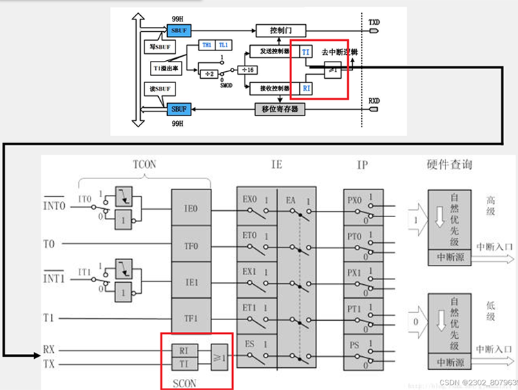
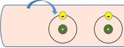
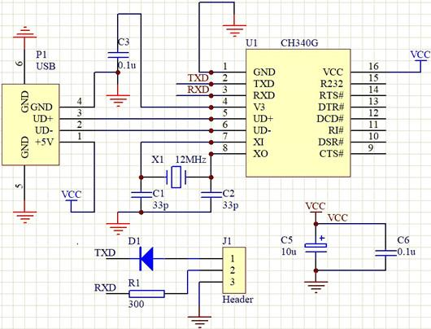
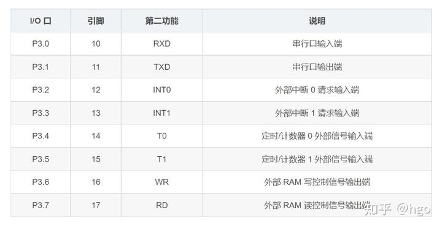
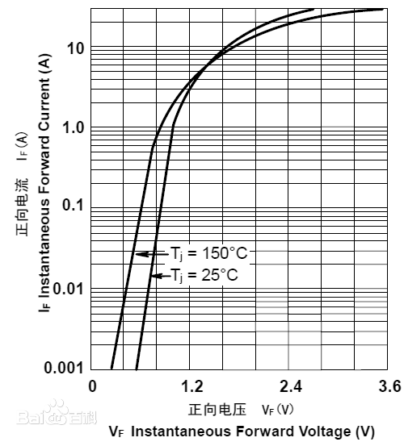
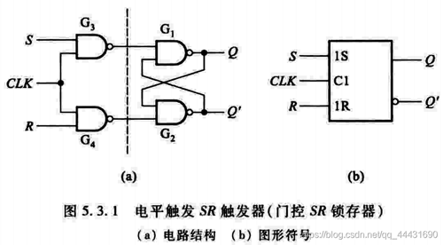
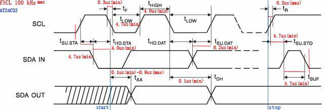
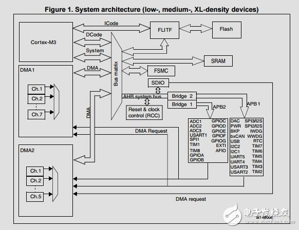
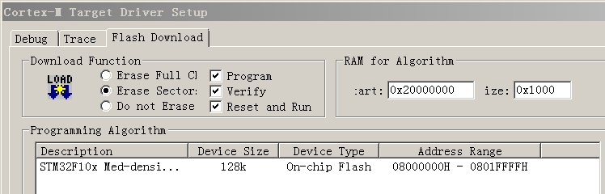

[STM32常见问题](#STM32常见问题)  
[STM32-f103C8T6-启动流程](#STM32-f103C8T6-启动流程)  
[GPIO操作流程](#GPIO操作流程)  
[STLink](#STLink)  
[RCC](#RCC)`Reset and Clock Control`   

[资料查询相关](#资料查询相关)  

[最小系统电路图](#最小系统电路图)  
-[复位电路增加电容的原因](#复位电路增加电容的原因)  
-[引脚编号](#引脚编号)  

[STC89C51RCRD硬件参数说明](#STC89C51RCRD硬件参数说明)  

{c}#ff00ff STC89C51RC{!c}{h2}icpdf/STC89C51RC-RD.pdf{!h2}  
{c}#ff00ff STC89CXX{!c}{h2}icpdf/STC89CXX.pdf{!h2}  
{c}#ff00ff STM32F103X6{!c}{h2}icpdf/STM32F103X6.pdf{!h2}  
{c}#ff00ff 89C51{!c}{h2}icpdf/89C51.pdf{!h2}  

[89c51硬件架构](#89c51硬件架构)  
-[寄存器Mapping](#寄存器Mapping)`寄存器的地址映射`  
-[中断](#中断)    
--[TCON寄存器](#TCON寄存器)`定时器相关`   
--[IE寄存器](#IE寄存器)`中断使能寄存器`  

-[定时器](#定时器)`TMOD寄存器的使用`  
-[UART](#UART)`串口`  

[电容](#电容)  
[模数转换](#模数转换)  
[电流](#电流)  
[功率](#功率)  

[led灯珠](#led灯珠)  

[晶振](#晶振)  
[二极管](#二极管)`常用二极管列表`  
[三极管](#三极管)

------------------------------------------

[Proteus软件](#Proteus软件)  

* [元件编辑面板](#元件编辑面板)`EditComponent`  
* [示波器](#示波器)  
* [自定义proteus元件](#自定义proteus元件)  

[常见问题](#常见问题)  
[Keil](#Keil)  

{r}▲{!r}[配置keil项目](#配置keil项目)  
[Keil uVision4命令行编译](#Keil uVision4命令行编译)  

 * [CommandLine](#CommandLine)`51编译器相关内容`  
 * [C51编译器注意事项](#C51编译器注意事项)`软件实现相关建议`  

{r}▲{!r}[Keil调试](#Keil调试)  
[Assembly](#Assembly)`汇编指令`  

{r}▲{!r}[CH340烧录程序](#CH340烧录程序)  

* [CH340烧录防倒灌电路](#CH340烧录防倒灌电路)  

[STARTUP.A51文件分析](#STARTUP.A51文件分析){r}启动流程{!r}  
[电阻](#电阻)  
[上拉电阻](#上拉电阻)  
[引脚说明](#引脚说明)`STC89C52引脚说明`  
[130电机](#130电机)  
[020电机](#020电机)  
[PWM](#PWM)`脉冲宽度调制`  
[协议](#协议)`UART SPI CAN Modbus CANopen Profibus Profinet EtherCAT`  
[数码管](#数码管)  
[C51数据类型](#C51数据类型)  
[术语](#术语)

* [数据手册常见参数](#数据手册常见参数)
* [亚稳态](#亚稳态)
* [Hz](#Hz)
* [死区时间](#死区时间)

[74HC373](#74HC373)`8 位串行输入,并行输出的位移缓存器`  
[模拟电路和数字电路的区别](#模拟电路和数字电路的区别)  
[数字电路](#数字电路)  
{r}▲{!r}[触发器](#触发器)  
[上升沿下降沿](#上升沿下降沿)  
[静态时序分析](#静态时序分析)  
[1602A](#1602A)`字符液晶显示模块`  
[74HC138](#74HC138)  
[74HC595](#74HC595)  
[74HC164](#74HC164)  

[IIC协议](#IIC协议) `IIC协议的时序操作说明`  

[AT24C32](#AT24C32) `带电可擦可编程只读存储器`  

[空心杯电机](#空心杯电机)  
[步进电机28YJ-48](#步进电机28YJ-48)  
[ULN2003](#ULN2003)----达林顿管  
[SG90陀机](#SG90陀机)  
[微动开关](#微动开关)  
[代码范例](#代码范例)  
[Keil常见编译错误](#Keil常见编译错误)  

[stc32g12k128](#stc32g12k128)  
[0.96寸oled](#0.96寸oled)`ssd1306`  

[Fritzing](#Fritzing)  
[ILI9341V驱动芯片](#ILI9341V驱动芯片)  

# 资料查询相关
元器件文档查询  {h}https://www.alldatasheetcn.com/{!h}  

电学理论  
{h}:8001/github/jjqmdlib/entry/doc.html?file=github\jdoc\dsp_electron.md{!h}  

# 最小系统电路图
  
  

# 复位电路增加电容的原因  

作用:  

{r}提供稳定电源{!r}  
当单片机启动时，它需要一个干净、稳定的电源来确保正常操作。复位电路中的电容能{r}够缓解电源波动和干扰对系统带来的影响{!r}，确保单片机能够在一个稳定的电源环境下启动和运行。  

{r}控制复位时间{!r}  
电容的充电和放电过程决定了复位信号的持续时间，从而控制了单片机的复位时间。具体而言，当系统上电时，电容开始充电，其充电时间决定了RST引脚保持高电平的时间，这个时间需要足够长以确保单片机能够正确复位。  

{r}滤波作用{!r}  
电容还具有滤波作用，能够在一定程度上滤除电源中的噪声和干扰，进一步稳定系统的电源，提高单片机的抗干扰能力。


1. 复位51单片机的条件是引脚上出现至少两个机器周期的高电平信号。
2. 在51单片机中，复位条件满足当RST引脚（即引脚9）持续接收两个机器周期以上的高电平。
3. 如果单片机的时钟频率为12MHz，每个机器周期持续1ms，那么只需RST引脚处的高电平持续时间超过2ms，即可触发复位

  

# 引脚编号  

  

PIN 32-PIN 39(P0)  
PIN 1-PIN 8(P1)  
PIN 21-PIN 28(P2)  
PIN 10-PIN 17(P3)  
PIN 40(VCC)电源 
# STC89C51RCRD硬件参数说明  

40IPDIP40  

* `40(40MHz) I(工业级别-40C~+85C) PDIP 40(封装类型)`  
  

89C52RC 401-PDIP40 2242H41U77.x90C  
  
  

        12T/6T          机器周期 = 12个时钟周期（12T）/机器周期 = 6个时钟周期（6T）

                        在传统8051架构中，大多数指令需要 1个或2个机器周期 完成。
                        例如：NOP（空操作）需要 1个机器周期（即12个时钟周期）。
                        MOV、ADD 等指令通常需要 1~2个机器周期。
                        MUL（乘法）、DIV（除法）等复杂指令可能需要 4个机器周期（即48个时钟周期）。
                        计算执行时间
                        如果使用 12MHz 晶振：
                        时钟周期 T = 12MHz/1=83.33ns
                        机器周期 = 12T = 1μs
                        NOP 指令执行时间 = 1机器周期 = 1μs

                        

                        +------------------------+
                        |         6T模式         |
                        +------------------------+
                        如果使用 12MHz 晶振：
                        时钟周期 T = 12MH/1=83.33ns
                        机器周期 = 6T =0.5μs
                        NOP 指令执行时间 = 1机器周期 = 0.5μs（比12T模式快一倍）

        5.5V-3.8V       `电源电压不能低于3.8v 高于5.8v`   
        
        8KB             Flash程序存储器

        SRAM(1280 bytes) Static Random-Access Memory
                        "Static"（静态）：只要保持供电，数据就不会丢失（无需刷新）。
                        "Random-Access"（随机存取）：可以按任意顺序读写数据，访问时间固定（与存储位置无关）。
                        "Memory"（存储器）：用于临时存储CPU运行时的数据和指令。

        40MHz 

外扩RAM上限 `2^16(P0,P1 16个地址总线)寻址空间为 65536 byte(64k)`  

# 89c51硬件架构


        `TMP1`		RAM (如 30H)	暂存累加器、中间计算  
        `TMP2`		RAM (如 31H)	辅助计算、数据交换  

        `RAM ADDR REGISTER`: RAM地址锁存器  
        `PORT0 LATCH`      : 端口0锁存器  
        `PORT0 DRIVERS`    : 端口0驱动  
        `PORT2 LATCH`      : 端口2锁存器  
        `PORT2 DRIVERS`    : 端口2驱动  

        `ACC`             :(Accumulator，累加器）是一个核心的8位寄存器，用于完成大部分算术逻辑运算
                        （如加减乘除、移位、逻辑操作等），以及数据传输操作。它是单片机中最繁忙的寄存器之一，与许多指令直接关联

        `STACK Pointer`   :堆栈指针

        `ALU`             :（Arithmetic Logic Unit，算术逻辑单元）
                        是计算机和微处理器（包括单片机）的核心部件之一，负责执行所有算
                        术运算（如加减乘除）和逻辑运算（如与、或、非、移位等）。它是CPU
                        的"计算引擎"，直接影响处理器的性能。

                        ---------------ALU的工作原理--------------- 

                        输入：从寄存器（如ACC）、内存或指令中获取操作数。
                        处理：根据控制信号（由指令译码器生成）选择特定运算。
                        输出：将结果存回寄存器（如ACC）或内存，同时更新状态寄存器（Flags）

                                   +---------+
                        操作数A -->|         |
                                   |   ALU   | --> 结果（存到ACC等）
                        操作数B -->|         |
                                   +----+----+
                                        |
                                        v
                                状态寄存器（Flags）:
                                - 进位（Carry）
                                - 零（Zero）
                                - 溢出（Overflow）
                                - 符号（Sign）等

        `SFRs TIMERS`             :（Special Function Registers，特殊功能寄存器） 和 TIMERS（定时器）二者紧密协作实现精准定时、计数、PWM生成等功能。

        `PROGRAM ADDRESS REGISTER`:程序地址寄存器  

        `BUFFER`                  :缓存器

        `PC INCREMENTER`          :程序地址指令累加器

        `PROGRAM COUNTER`         :程序地址寄存器

        `DPTRS MULIPLE`           :数据指针寄存器  

        `TIMING AND CONTROL`      :定时器和控制单元

        `INSTRUSTION REGISTER`    :指令寄存器

        `OSCILLATOR`              :晶振

        `PD`                      :掉电模式（Power Down）触发信号


  

# 寄存器Mapping
  

        Memory Class Address Range Description 
        DATA D:00    – D:7F Direct addressable on chip RAM. 
        BIT D:20     – D:2F bit addressable RAM; accessed bit instructions. 
        IDATA I:00   – I:FF Indirect addressable on chip RAM; can be accessed with @R0 or @R1. 
        XDATA X:0000 – X:FFFF 64 KB RAM (read/write access). Accessed with MOVX instruction. 
        CODE C:0000  – C:FFFF 64 KB ROM (only read access possible). Used for executable code or constants. 
        BANK 0
        … BANK 31 B0:0000 – B0:FFFF
        B31:0000 – B31:FFFF - Code Banks for expanding the program code space to 32 x 64KB ROM.

# 中断
 

# TCON寄存器
  
TF1：定时器/计数器T1溢出标志。T1被允许计数以后，从初值开始加1计数。当最高位产生溢出时由硬件置“1”TF1，向CPU请求中断，一直保持到CPU响应中断时，才由硬件清“0”TF1（TF1也可由程序查询清“0”）。

TR1：定时器T1的运行控制位。该位由软件置位和清零。当GATE（TMOD.7）=0，TR1=1时就允许T1开始计数，  TR1=0时禁止T1计数。当GATE（TMOD.7）=1，TR1=1且INT1输入 高电平时，才允T1计数。  

TF0：定时器/计数器T0溢出中断标志。T0被允许计数以后，从初值开始加1计数，当最高位产生溢出时，  由硬件置“1”TF0，向CPU请求中断，一直保持CPU响应该中断时，才由硬件清“0”TF0（ TF0也可由程序查询清“0”）。

TR0：定时器T0的运行控制位。该位由软件置位和清零。当GATE（TMOD.3）=0，TR0=1时就允许T0开始计数，  TR0=0时禁止T0计数。当GATE（TMOD.3）=1，TR0=0且INT0输入 高电平时，才允许T0计数。  

IE1：外部中断1请求源（INT1/P3.3）标志。IE1=1，外部中断向CPU请求中断，当CPU响应该中断时由硬件清“0”IE1。  

IT1：外部中断1触发方式控制位。IT1=0时，外部中断1为低电平触发方式，当INT1（P3.3）输入低电平时，置位IE1 。  
采用低电平触发方式时，外部中断源（输入到INT1）必须保持低电平有效，直到该中断被CPU 响应，同时在该中断服务程序执行完之前，  
外部中断源必须被清除(P3.3要变高)，否则将产生另一次中断。当IT1=1时，则外部中断1(INT1)端口由“1”→“0”下降沿跳变，激活中断请求标志位IE1 ，向主机请求中断处理。  

IE0：外部中断0请求源（INT0/P3.2）标志。IE0=1外部中断0向CPU请求中断，当CPU响应外部中断时，由硬件清“0”IE0（边沿触发方式）。

IT0：外部中断0触发方式控制位。IT0=0时，外部中断0为低电平触发方式，当INT0（P3.2）输入低电平时，置位IE0。  
采用低电平触发方式时，外部中断源（输入到INT0）必须保持低电平有效，直到该中断被CPU响应，同时在该中断服务程序执行完之前，  
外部中断源必须被清除（P3.2要变高），否则将产生另一次中断。当IT0=1时，则外部中断0(INT0)端口由“1”→“0”下降沿跳变，激活中断请求标志位IE0 ，向主机请求中断处理。  

 
{r}TCON寄存器说明{!r}  

`TCON寄存器是定时器控制寄存器（Timer Control Register）的简称，用于控制定时器/计数器的启动、停止以及外部中断的管理。TCON寄存器在单片机中占据一个字节，共有8个位，每个位都有特定的功能。`  


    +-----------------------------------------------+
    |  7  |  6  | 5   |  4  |  3  |  2  |  1  |  0  |
    +-----------------------------------------------+
    | TF1 | TR1 | TF0 | TR0 | IE1 | IT1 | IE0 | IT0 |
    +-----------------------------------------------+

所谓的中断源，就是引起中断的事件；  

1、（INT0）：对应的是P3.2引脚的外部中断0，可由（TCON.0）选择其为低电平有效还是下降沿有效；当CPU检测到P3.2引脚时出现有效中断信息时，向CPU申请中断。  

2、（INT1）：对应的是P3.3引脚的外部中断0，可由（TCON.1）选择其为低电平有效还是下降沿有效；当CPU检测到P3.3引脚时出现有效中断信息时，向CPU申请中断。  

3、T0：对应的是`P3.4`引脚；`TF0（TCON.5）`片内定时/计数器T0溢出中断标志位，当定时/计数器`T0`发生溢出时，置位`TF0`，向CPU申请中断。  

4、T1：对应的是P3.5引脚；TF1（TCON.7）片内定时/计数器T0溢出中断标志位，当定时/计数器T1发生溢出时，置位TF1，向CPU申请中断。  

5、RXD 和 TXD： 对应的是 P3.0 和 P3.1 口的附加功能，RI（SCON.0）或 TI （SCON.1），串行口中断请求标志。当串行口接收完一帧串行数据时置位 RI 或 当串行口发送完一帧串行数据时置位 TI，向 CPU 申请。  

# IE寄存器  

`IE 中断允许控制寄存器，电工学用语。用于控制所有中断源的开放或禁止，以及每个中断源是否被允许。`  

    +--------------------------------------------------------------------------------------+
    |                             | 7  | 6 | 5   | 4 |  3  |  2  |  1  |  0  | Reset Value |
    +--------------------------------------------------------------------------------------+  
    | IE | A8h | Interrupt Enable | EA | - | ET2 | ES| ET1 | EX1 | ET0 | EX0 | 0000 0000   |  
    +--------------------------------------------------------------------------------------+  


作用:中断使能  

{r}注意事项{!r}  
中断时间不能小于机器周期时间，主程序还未执行完成就会跳出主程序地址空间  

# 定时器

`TMOD寄存器`  

    51单片机的数据存储结构  
    +--------+---------+
    | address|  value  |
    +--------+---------+
    | 0x01   |0000 0000|
    +--------+---------+
    | 0x02   |0000 0000|
    +------------------+

T0方式时TH0和TL0寄存器中的值的计算方法   

12MHz频率晶振一个周期是1us,也就是说这个主频的单片机的{r}能够中断的最小时长是1us{!r}  

        +-----+-----+
        |TH0  |TL0  |
        +-----+-----+
2^16(65536)计数周期溢出一次  


可以得出溢出一次的最大时间为65536us  

假设要设置1000us之后溢出 可得TH0TH1中的值为(65536-1000)即64536  

        +-----+---------+---------+
        |     |   0x8C  |   0x8A  |
        +-----+---------+---------+   
        |     |   TH0   |   TL0   |
        +-----+---------+---------+
        | BIN |1111 1100|0001 1000|  
        +-----+---------+---------+
        | HEX |  0xFC   |  0x18   |
        +-----+---------+---------+
        | DEC |       64536       |
        +-------------------------+
    

{file}c51/test.c@TIME_TEST{!file}  

TMOD寄存器  

       +----+-----+----+----+------+-----+----+----+
       | 7  |  6  | 5  | 4  |   3  |  2  | 1  | 0  |
       +----+-----+----+----+------+-----+----+----+
       |GATE| C/T | M1 | M0 | GATE | C/T | M1 | M0 |
       +----+-----+----+----+------+-----+----+----+
       |         T1         |          T0          |
       +--------------------+----------------------+


  


```
12M晶振每秒可产生1M个机器周期，1M个机器周期就是1000000个机器周期。一个机器周期为1us, 
50ms就需要50000个机器周期，定时器在方式1工作，为16位，最大值为65536，
所以需设初值为65536-50000=15536；

15536/256得到高八位，因为高八位都是256的倍数，15536%256得到低八位，
因为低八位最大为128，所以对256取余。
15536转化为16进制得3cb0；故高位TH0=0x3c;TL0=0xb0;

不同频率晶振产生的机器周期不一样：
公式为：机器周期=晶振频率/12。时钟周期=1/晶振频率。时钟周期*12=机器周期=12/晶振频率。
每秒的机器周期个数=1/机器周期=晶振频率/12。这是在该晶振频率下每秒产生多少M机器周期。

比如当晶振频率为11.0592M的晶振。则每秒可产生机器周期为11.0592/12=0.9216M的机器周期，
也就是921600个机器周期。50ms等于0.05秒，所以需要921600*0.05=46080个机器周期；
定时器在方式1工作，为16位，最大值为65536，所以需设初值为65536-46080=19456；
转为16进制为（4c00）,所以高位TH0=0x4c; TL0=0x00;
```

  

# UART
{h}https://blog.csdn.net/2302_80796399/article/details/136069172{!h}  

     +-----+----+-----------------------------------------------+
     |     |    |  7  |  6  | 5   |  4  |  3  |  2  |  1  |  0  |
     +-----+----+-----------------------------------------------+
     | 98h |SCON| SM0/FE| SM1 | SM2 | REN | TB8 | RB8 | TI | RI |
     +-----+----------------------------------------------------+
     | 99h |SBUF|  x    |  x  |  x  |  x  |  x  |  x  | x  | x  |
     +-----|----+-----------------------------------------------+

```
1.RI
RI是接收标志位，当51单片机接收到外部设备发送的数据时，RI会被置位。
当进行下一次接收时需要手动将RI清零。

2.TI
TI是发送标志位，当51单片机要发送数据时，TI会被置位。
当进行下一次发送时需要手动将TI清零。

3.SUBF
SBUF是串口缓冲区，它用于存放51单片机接收到的数据和要发送的数据。
SBUF一次只能发送和接收一个字节的数据。

三、串口波特率的计算
51单片机串口波特率的计算方法是：波特率=时钟频率/（16*（256-波特率寄存器值））。其中，时钟频率是51单片机的时钟频率，波特率寄存器值是51单片机的波特率寄存器的值。
```

**串口助手设置**

  

{file}c51/test.c@UART{!file}  

  
  
  


欧姆定律
```
标准式:  
I=U/R  

变式：  
U=I×R  
R=U/I  

```
# 模数转换
  

# 电容
  

# 电流
```
1kA=1000A，1A＝1000mA，1mA＝1000μA，1μA＝1000nA，1nA＝1000pA，1pA＝1000fA

库仑是电荷量单位，简称库，用C表示。它是为纪念法国物理学家库仑（Charles-Augustin de Coulomb, 1736～1806）而命名的。
库仑不是国际单位制基本单位，而是国际单位制导出单位。1库仑=1安培·1秒，即1C=1A·s。

其大小定义为：若导线中载有1安培的稳定电流，则在1秒内通过导线横截面的电量为1库仑。基本换算为1库仑=1安培·秒（1A·s）。
一个电子所带负电荷量e=1.602176634×10^19库仑，即1库仑相当于6.24150974×10^18个电子所带的电荷总量。

```
一安培相当一秒通过1C的电量 1C约相当于`6.25×10^18`个电子的电量.

I = Q/t 
```
I 电流强度(安培)
Q 电荷单位库伦
t 时间(秒)
```


电子在原子之间如何运动的  
  

# 功率

1、计算电功率的通用公式是（1）定义式P=W/t

1瓦=1焦耳/秒

（2）P=UI，即电压和电流的乘积1瓦=1伏安

2、对于纯电阻电路：

P=I^2·R 过P=U^2/R

单位： 1瓦=1安^2欧=1伏^2/欧。

漏极开路  


**电子发烧友**  
https://m.elecfans.com

proteus仿真  

http://www.stcmcudata.com/

http://www.stcmcudata.com/datasheet/STC89C52.pdf

EA:内外ROM选择端  

# led灯珠  

单向导电性 

长引脚为+级
```
直径 3mm 插件LED
红黄灯珠电压是 1.8V-2.2V，
蓝绿白灯珠电压是 3.0V-3.6V。
额定电流都是 20 mA，使用是电流 15 mA。

5mm黄LED灯 电压2.0-2.2V

额定电流就是在额定情况下（额定电压、额定负载）的电流值，也可以认为就是正常工作时候的电流，而实际电流就是实际上流过这个东西的电流，受很多因素影响，它可以等于额定电流也可以不等于。
```

led灯珠:二极管是非线性元件
```
在电子电路中，非线性元件（英语：nonlinear element），或称非线性器件（nonlinear device）是电流-电压关系为非线性的电子元件。例如，在二极管中，通过晶体管的电流是其两端电压的非线性函数：
```


**面包板**  
  

电压和电阻的数学关系式式是：R=U/I。（电阻=电压/电流）

# 晶振  
  
无源晶振（两个引脚的）没有正负  
有源晶振 （多是4个引脚扁平封装）只有一个输出，接错了是不会工作的  

hc-49是11.0592MHz是无源晶振  

{r}晶振的频率除以12，就是单片机的频率。假如，你的外接晶振是12MHz，那么单片机的主频率就是1MHz。{!r}

```
首先，要知道频率的概念，频率是指物体每秒振动的次数。或在一定时间或范围内某种事物发生或出现的次数。

在单片机中经常能听到诸如12MHz 72MHz这样的词。

它代表的意思就是晶振每秒钟震动的次数，例如12MHz就是每秒能震动12*10^6次，常见于51单片机的晶振。

而51单片机又有12分频(12T)和1分频(1T)，其中12分频的意思就是单片机的标准运算速度是晶振(12MHz)的12分之1，即12分频下，单片机的运行速度为1秒钟震动10^6次。

12MHz的12分频(频率为1MHz)下单片机震动1次则历经1us(T=1/F=1s/10^6=1us)，震动1000次则历经1ms。
12MHz的1分频(频率为12MHz,等于不分频)则是一秒钟震动12*10^6次，此时，单片机震动1次历经1/12us，
震动12000次才历经1ms。频率越大，震动次数越快，则震动同样次数花费的周期就越短。

72MHz则常见于STM32单片机，晶振一秒震动72*10^6次，则此频率下单片机1us震动72次。可见其速度之快。
```

`指令周期>机器周期>时钟周期`  


`4分频电路`  
  

{r}分频的原因{!r}  
```
可以想要的时间精度和总线通信不同的通信速率  
分频之后可以使输入的速度降低,单片机可以更好的响应  
```
{r}晶振频率和时钟频率之间的关系{!r}
```
时钟频率是通过晶振提供的信号来计数得到的。
倍频和分频,是调整时钟频率的一种方式，通过倍增晶振频率来实现。
如果晶振频率为100MHz，倍频设置为10倍，则时钟频率为1GHz
10分频的结果就是晶振频率为100MHz则时钟频率为10MHz
```

```
Vin ： 稳压前电压输入端
Vout ： 稳压后电压输出端
GND ： 接地（公共端）GND是电线接地端的简写。代表地线或0线。这个地并不是真正意义上的地，是出于应用而假设的一个地，对于电源来说，它就是一个电源的负极

Vin 与GND 构成电压输入回路，Vout 与GND构成电压输出回路
```
**Flash程序储存器**  
STC89c52的程序代码存储空间是8kb

**RAM**  
随机存取存储器（英语：Random Access Memory，缩写：RAM），也叫主存，是与CPU直接交换数据的内部存储器。它可以随时读写（刷新时除外），而且速度很快，通常作为操作系统或其他正在运行中的程序的临时数据存储介质。RAM工作时可以随时从任何一个指定的地址写入（存入）或读出（取出）信息。它与ROM的最大区别是数据的易失性，即一旦断电所存储的数据将随之丢失。RAM在计算机和数字系统中用来暂时存储程序、数据和中间结果。

**SRAM**  
静态随机存取存储器（Static Random-Access Memory，SRAM）是随机存取存储器的一种。所谓的“静态”，是指这种存储器只要保持通电，里面储存的数据就可以恒常保持。相对之下，动态随机存取存储器（DRAM）里面所储存的数据就需要周期性地更新。然而，当电力供应停止时，SRAM储存的数据还是会消失（被称为volatile memory），这与在断电后还能储存资料的ROM或闪存是不同的。  
**EEPROM**  
EEPROM (Electrically Erasable Programmable read only memory)是指带电可擦可编程只读存储器。是一种掉电后数据不丢失的存储芯片。 EEPROM 可以在电脑上或专用设备上擦除已有信息，重新编程。一般用在即插即用。  

**电容**  
```
电容的识别方法与电阻的识别方法基本相同，分直标法、色标法和数标法3种。电容的基本单位用法拉（F）表示，其它单位还有：毫法（mF）、微法（uF）、纳法（nF）、皮法（pF）。其中：1法拉=103毫法=106微法=109纳法=1012皮法

通常在容量小于10000pF的时候，用pF做单位，大于10000pF的时候，用uF做单位。为了简便起见，大于100pF而小于1uF的电容常常不注单位。22前两位指的是电容也就是22PF，如果是222就是2200PF最后的2指的是0的个数。

电容上面写着103表示电容的容量，103=10000P，103=0.01U。是普通类型的，瓷片电容、涤纶电容、独石电容等等的简单标注方法，意思是，电容单位为pF，容量为10后面加3个0，就是10000pF，类似的303，就是30000pF，473就是47000pF。


1法拉（F）= 10^3毫法（mF）=10^6微法（μF）=10^9纳法（nF）=10^12皮法（pF）=10^15fF

```
`铝电解电容长脚为正极`  
`电阻是无极性的`  

**测量电容**  
1.机械调0  
2.选择CX量程(uf)  
3.电容放电  


# 二极管
  

# 三极管
```
BC337  BC327 2N2222 2N2907 2N3904  
2N3906 S8050 S8550  A1015  C1815  
```

```
BJT 的全称是双极性结型晶体管（Bipolar Junction Transistor），国内俗称三极管。其实，在英语中，三极管（triode）
特指以前的真空电子管形式的三极管，而不是我们现在普遍使用的半导体三极管。“tri-”的意思是“三”，“ode”的意思是“极”，
当年的电子管一般都封装在一个圆柱形的真空玻璃管中，所以中文翻译在后面加了个“管”。
```

* `2N2222A338手册`  

`https://www.taodocs.com/p-480173207.html`

  
  

  
  

Vceo Collector-Emitter Voltage  40V      {r}Vce最大承受电压{!r}  
Ic collector current(DC)        800mA    {r}可通过最大电流{!r}  
hFE DC current gain {r}当前增益放大倍数{!r}  
# Proteus软件 
* +/- 正/反向旋转元件  
* Component Mode 组件模式  
* Pick Derices --->添加元件组件

  * ATC85C02  
  * RES(电阻),LED-RED,CAP(电容),CRY(晶振),CELL(电源),BUTTON(开关)  
  * MOTOR-DC(直流马达电机)  
  * BUZZER蜂鸣器  
  * Transistors为三极管组件包  
  * RESPACK-7和RESPACK-8(排阻)`修改Park Value的值就是每个电阻的值`  
  * 7seg`数码管`
        ```
        提供1位、2位、4位、6位、8位数码管，在库中搜索7seg即可查找到所有7段数码管。名称中7SEG表示7段数码管，MPXx代表数码管位数，CA表示共阳极，CC表示共阴极。
        ```  
   * 二极管 Pick Devices/Diodes  
   * 三开关 Pick Devices/SW-ROT3  

   *  串口终端:Virtual Instruments Mode的VIRTUAL TERMINAL,可在Viryual Terminal 右键设置Hex Display Mode(16进制显示)  
        Echo Typed Characters (输出字符)  

* 无源蜂鸣器原理  
```
方波驱动。无源蜂鸣器是用于音圈接入交变电流后形成的电磁铁与永磁铁相吸或相斥而推动振膜发声的设备，
无源蜂鸣器发声需要方波驱动触发，方波频率即为其发声频率，无源蜂鸣器利用电磁感应现象，
为音圈接入交变电流后形成的电磁铁与永磁铁相吸或相斥而推动振膜发声，接入直流电只能持续推动振膜而无法产生声音，只能在接通或断开时产生声音。
```


* 修改图纸尺寸 System/set sheet size  
in:inch英寸缩写

* 修改栅格大小  
View/Snap 0.1in  

* 快捷键  
{r}F8{!r} 图纸最大化

* {r}导出图纸{!r}File/Export/Graphic  

* {r}导入片段{!r}File/Import Project Clip 
* {r}导出片段{!r}框选组件 Export Project Clip  

`电源`  
终端模式里的电源是两个分开的，一个是power，即VCC，一个1是ground，即是GND。画仿真图时，不管放几个VCC和GND端子，都是公共的，且与GND配对的，是一个公用电源。

但是有些电路，要求两个或多个电源是独立的，互不连接，这时就不能再用VCC和GND端子了。而必须用元件库中的独立电源source。因为这些(分交，直流电压源和电流源)电源元件是有两个端子，如直流电压源有正，负端子。这样，仿真图中放几个电源都是相互独立的，只要在电路上不把几个电源端子相连，就是几个独立的电源。
这就是两种电源的最大区别。

`标记`  
https://blog.csdn.net/jibhikk/article/details/127642468

{r}灰点{!r} 表示电平不能确定 `比如在P0.0没有加上拉电阻 这时候就会导致电平不确定`  
{r}红点{!r} 表示确定的高电平   
{r}蓝点{!r} 表示确定的低电平  

如果此点没有在程序或硬件里确定高低，属正常。
如果已经确定，仍是灰点，检查程序或电路。

单片机p0口默认高电平

Terminals Mode中的 DEFAULT用于设置标签

# 元件编辑面板
`Model Type` Analog模拟型号 Digtal数字信号  

`Forward Voltage` 正向电压:二极管在正向偏置(当外界又正向电压偏置时,引起正向电流的行为)时,使电流通过时的最小电压  

`Full drive current` 负载电流(设备正常工作时需要的电流)  

`Breakdown Boltage` 二极管击穿电压，超过此电压二极管损坏  

# 示波器

示波器`OSCILLOSCOPE MODEL`
        重置示窗口:`Debug/Reset Debug Pops Windows`  
        设置鼠标拾取方波线 {r}TRIGCURSORS:TRUE{!r}    
        右键print输出pdf或者xps(setup设置输出配置)  
        Setup(Black and White黑白输出 Center on Zoom 居中缩放)  
        鼠标中间缩放视图  

ABCD代表4个信号通道,只需要根据需要接上几个信道

```
Four channel or X-Y operation. 
Channel gain from 20V/div to 2mV/div with 2.5x accurate set-up. 
Timebase from 200ms/div to 0.5us/div with 2.5x accurate set-up. 
Automatic voltage level triggering locked to either channel. 
AC or DC coupled inputs. 
A+B and C+D channel modes. 
Invert button for each channel. 
Mouse zoom in and out. 
Cursors measurement. 
One-shot mode with zoom in and out possibility. 
Printing. 
Colour change for each channel. 
```
  
上图连接A信道 选择DC模式  

VSINE:交流电源  
Amplitude:振幅 311(220*Math.sqrt(2))  
Frequency:频率 50  
功率：220，频率：50hz  

# 自定义proteus元件
{h}https://blog.51cto.com/u_16099277/10255698{!h}  
1 2D Graphics Box Mode(组件)  
2 COMPONENT() PIN(管脚)  

# 常见问题

 {r}1.电压表读数是0{!r}  
 在使用Proteus打开项目文件时，经常会遇到如下错误提示：`Symbol“$MKRMISSING“used but not found in libraries`
`解决办法` 在“Proteus 8 Professional”图标上单击右键，选择“以管理员身份运行”，即可解决。

{r}2.为什么在proteus中没有VCC引脚?{!r}  
因为proteus默认接上电源了，所以隐藏了就不必管它了  

{r}3.为什么延时实现用多个u_delay255MS函数而不使用for循环实现?{!r}  
因为for也是会占用时钟周期的,而函数压栈消耗的时钟周期的误差时间小  

{r}Proteus-> Schematic Capture:No Libraries Found{!r}  


{r}4.关于使用for循环实现延迟的问题{!r}  
```
优点
简单易用：不需要复杂配置
不依赖外设：纯软件实现
适用于短延迟：对于微秒级的短延迟比较实用
----------------------------------------------
缺点
不精确：延迟时间受编译器优化、CPU频率影响大
浪费CPU资源：CPU被完全占用，不能执行其他任务
可移植性差：在不同频率的MCU上需要重新调整循环次数
难以维护：代码可读性差，难以准确计算延迟时间

----------------------------------------------
更优的替代方案

硬件定时器：
使用MCU内置的定时器/计数器
精确可靠，不占用CPU资源
可配置中断实现多任务

系统滴答定时器(SysTick)：
Cortex-M内核提供的专用定时器
适合操作系统的时间基准

看门狗定时器：
在低功耗应用中可作为延迟使用
----------------------------------------------
在实际项目中，建议尽可能使用硬件定时器来实现精确延迟，for循环延迟只应在资源极其有限或延迟要求不高的场景下使用。
```

# Keil

**Keil uVision4安装破解**  
Keil C51是美国Keil Software公司出品的51系列兼容单片机C语言软件开发系统。
```
使用说明：

开打KEIL软件file---License Management
打开注册机。
拷贝CID:里的内容到注册机里的CID:
点击注册机里的GENERATE生成代码。然后拷贝注册码到keil里的
New License ID Code 中，点击ADD LIC即可。

再拷贝注册机下面的L51.DLL文件到C:\Keil\C51\BIN下代替原来文件级可。
重新启动KEIL完成注册。
```
# 配置keil项目

new project  

  

选择Atmel/AT89C52  

弹出下面对话框选择ok(意思是说是否将8501的标准库添加到项目中去)
> Copy Standard 8051 Starrup Code to Project Fold Add File to Project?  

*将代码添加到工程*  
右键Source Group 1,Add files to Group"Souce Group 1"  

{r}编译{!r}  
Project/Build Tagrt(F7)

```
Build target 'Target 1'
assembling STARTUP.A51...
compiling test.c...
linking...
Program Size: data=9.0 xdata=0 code=16
"a1" - 0 Error(s), 0 Warning(s).
```
*清理*
Project/Clean Target

*输出设置*  
Project/Options for Taggets 'Target1'  
Target页签的Atmal AT89C52的Xtal(MHz)填写`11.0592`晶振频率  

Output页签勾选Create HEX File HEX Format: `HEX-80` 会生成.hex的目标文件(十六进制代码)

*文件说明*

*plg Contents of the Build Window for Each Make(每次构建的日志)  

*调试*  
Debug->Start/Stop Debug Session

*快捷键*  
f7 编译  
ctrl+ f5 启动调试/退出调试  
f9下断点  
ctrl+shift+f9 清除所有的断点  

*清理*
Project/Clean Taget  

{r}修改时钟频率{!r}  
Option for Target/Xtal(MHz) (如填写12Mhz)  

# Keil uVision4命令行编译

`compile.bat`  
{file}cmd/compile.bat{!file}

`vscode配置c_cpp_properties.json`  
{file}c51/.vscode/c_cpp_properties.json{!file}  
头文件路径定义
```
"./libs/**" //C51自定义工具库
```

官网{h}https://developer.arm.com/documentation/101407/0539/Command-Line{!h}

```
*** WARNING L1: UNRESOLVED EXTERNAL SYMBOL
```
说明没有添加*.c文件(即使添加了.h)需要Add Files to Group

可以检查文件*.uvproj来判断是否添加成功 
        
        <File>
                <FileName>utils.c</FileName>
                <FileType>1</FileType>
                <FilePath>..\libs\utils.c</FilePath>
        </File>

{r}加一个.c文件就需要在*.uvproj里添加这个xml配置{!r}  

{r}编译警告{!r}
```
*** WARNING L16: UNCALLED SEGMENT, IGNORED FOR OVERLAY PROCESS
    SEGMENT: ?PR?_U_SETV?UTILS

在Keil C中，如果没有显式调用到定义过的函数，就会出现这样的的警告。
```
{r}在这个函数中的变量，不会被列入覆盖分析范围内，也就是说这些变量占的空间不能被回收，这对于为数不多的RAM资源可是巨大的浪费{!r}

忽略警告`option for target —>bl51 misc —>disable warning ==这里写入16`  

`Keil Cx51 Compiler`  

`https://blog.csdn.net/tianpu2320959696/article/details/121504024`  

{r}开启Keil编译时创建批处理文件{!r}勾选`Keil/Option for Targets/Output/Create Batch File`  
# CommandLine

可以参考Target 1.BAT进行自动化构建  

build All target files...可以重新生成  

{file}c51/test.c@编译流程{!file}
{r}A51 for Assembler Compiling{!r}  

{r}C51 Compiling C files{!r}  

`C51 sourcefile <[>directives...<]>`  
`C51 @commandfile`  

`@REM 编译时传入定义宏`  
`C51 testfile.c SYMBOLS CODE DEBUG`  

编译宏  
`ROM(SMALL) BROWSE DEBUG OBJECTEXTEND`  
```
ROM
(SMALL), (COMPACT), (LARGE), (D512K), or (D16M)
Options — Target — Code ROM Size.
```

`编译器:C:\Keil\C51\BIN\C51.exe`  
`文档:C:\Keil\C51\hlp\c51.chm`  

`https://blog.csdn.net/jdm_sam/article/details/135892118`  

{r}BL51 Linking Programs{!r}  
```
The BL51 Linker/Locator merges segments from object modules, locates them, and creates programs. This manual describes how to use BL51 and includes the following chapters.
```

`BL51 <[>inputlist<]> <[>TO outputfile<]> <[>directives<]>`  
`BL51 @commandfile`  

{r}OH51 banked_obj_file{!r}  
`OH51 abs_file <[>HEXFILE (file)<]>`  
`OH51 MYFILE HEXFILE(MYFILE.HEX)`  

{r}github/nodelib/c51_compile2.js说明{!r}  
{file}c51/filelist.json{!file}  
{file}github/nodelib/c51_compile2.js@filelistjson{!file}  
{file}github/nodelib/c51_compile2.js@c51compile说明{!file}  

{r}xtal{!r}  
xtal表示外部晶振（或外接晶振）（External Crystal Oscillator)。而外部晶振常常连接至单片机的腿（PIN），常常使用XTAL加上数字表示连接外部晶振。X取的是External的其中一个字母。国外经常以X表示外部，而表示内部的用I（Internal)。 

# C51编译器注意事项
* 函数内data声明的字符缓冲区会占用程序存储空间
```c
void func(){
        char data out[] = "               ";
}
```

* Cx51 Compiler User`s Guide/Language Extensions/Data Types  

        Data Types Bits Bytes Value Range 
        bit 1   0 to 1 
        signed char 8 1 -128 — +127 
        unsigned char 8 1 0 — 255 
        enum 8 / 16 1 or 2 -128 — +127 or -32768 — +32767 
        signed short int 16 2 -32768 — +32767 
        unsigned short int 16 2 0 — 65535 
        signed int 16 2 -32768 — +32767 
        unsigned int 16 2 0 — 65535 
        signed long int 32 4 -2147483648 — +2147483647 
        unsigned long int 32 4 0 — 4294967295 
        float 32 4 ±1.175494E-38 — ±3.402823E+38 
        double 32 4 ±1.175494E-38 — ±3.402823E+38 
        sbit 1   0 or 1 
        sfr 8 1 0 — 255 
        sfr16 16 2 0 — 65535 

* 中断实现延时比软件延时更加精确

# Keil调试  

打开`Keil uVision4`  

1.Project/Build Target 编译目标  

2.可在代码行前F9下断点 Ctrl+F5打开`Start/Stop Debug Session`进行断点调试  

{r}Logic Analyzer{!r}  
逻辑分析器    
View/Analyzer/Logic Analyzer  

Zoom:[In放大 Out缩小 All显示全部]  

在视图中使用Left Right可以移动到电平跳变沿位置  

View/Symbols Window/Simulator VTREG{r}模拟器标识字符串{!r}
可以在`逻辑分析器中查看`比如PORT2就标识引脚Port2  

可watch的变量  

  

Setup  
  

{r}注意{!r}  
应用场景和理论情况会出现一定的误差(例如一个机器周期的值和预期值只是近似等于)  


        +--------------------+
        |  Registers  Panel  |
        +--------------------+

  

{h}https://blog.csdn.net/weixin_29529733/article/details/117106913{!h}  

**Register Banks**

r0~r7 8个通用寄存器
```
The 8051 is an accumulator-based microcontroller with eight general-purpose registers (R0-R7). Each register is a single byte register. All eight general-purpose registers may be considered a bank of registers or a register bank. 
The 8051 provides four register banks you can use. The primary reason for multiple register banks becomes apparent when you use interrupts. 
For typical 8051 C programs there is no need to select or switch register banks. Register bank 0 is used by default. 
Register bank 1, 2, or 3 are best used in interrupt service routines to avoid saving and restoring registers on the stack
```

`Regs是片内内存的相关情况值，Sys是系统一些累加器、计数器等。`  
**a**  
累加器ACC，往往在运算前暂存一个操作数(如被加数)，而运算后又保存其结果(如代数和)。  

**b**  
寄存器B ，主要用于乘法和除法操作  

**sp/sp_max**  

**dptr**  
数据指针DPTR  

**sec**  
执行指令的时间累计(单位 秒)
{r}单指令执行执行的时间受时钟频率影响{!r}  

**states**  
执行指令的数量{r}指令已经执行了多少周期数{!r}  

* 可以通过此参数值查看每条汇编指令需要的指令周期数,在做精确延时功能的时候特别有用  

**psw**  
PSW是Program Status Word的缩写，即程序状态字（也叫程序状态寄存器），可用于OS在管态（系统态）和目态（用户态）之间的转换。  
程序状态标志寄存器PSW，八位寄存器，用来存放运算结果的一些特征，如有无进位、借位等。   

**PC**  
PC：程序进计数器（program count）是控制器中最基本的寄存器，它是一个独立的16位计数器，用户不能直接使用指令对PC进行读/写。当单片机复位时，PC中的内容为0000H，即CPU从0000H单元取指令，开始执行程序。
PC的基本工作过程是：CPU读指令时，PC内容作为欲读指令的地址发送给程序存储器，然后程序存储器按此地址输出指令字符，同时PC自动加一，这也为什么PC被称为程序计数器的原因。由于PC实质上是作为程序寄存器的地址指针，所以也成为程序指针。
PC内容的变化轨迹决定了程序的流程。由于PC是用户不可能直接访问的，当程序顺序执行的时自动加一；执行转移程序、子程序、或者中断子程序程序调用时，由运行的指令自动将其内容更改为所要转移的目的地址。
在单片机调试时候，如果执行的时单周期指令则PC自动加1，如果执行的是双周期指令则自动加2，如果是三周期指令则自动加3.

# Assembly
指令周期:不同的操作指令周期数不一样  
{r}MOV{!r}
```
The MOV instruction moves data bytes between the two specified operands. The byte 
specified by the second operand is copied to the location specified by the first operand.
 The source data byte is not affected.
```

        +---------------+     +------------------------+
        |  TMOD = 0x01  |---->|  MOV TMOD(0x89),#0x01  |
        +---------------+     +------------------------+

将数据0x01移动到寄存器TMOD中,该寄存器地址位于0x89  

{r}NOP{!r}  
```
The NOP instruction does nothing. Execution continues with the next instruction. 
No registers or flags are affected by this instruction.
NOP is typically used to generate a delay in execution or to reserve space in code memory.
```
Operation PC = PC + 1  {r}一个机器周期偏移{!r}  

NOP执行一次为机器周期的时间
12mHz的晶振NOP的时长是  
`1机器周期 = (12000000 us / 12时钟周期 /1000000 = 1 us`  

一个函数调用占用4个机器周期  

# CH340烧录程序  
  
第一步: 
CH340 插入电脑之后会在设备管理器端口列表中显示`USB-SERIAL CH340 (COM8)`

打开程序文件(hex格式的)


`https://www.bilibili.com/video/BV1cA411h7uP/?spm_id_from=333.337.search-card.all.click&vd_source=7ff01eb5b072e68bd34fee02e09ef931`  

**CH230G (STC-ISP)下载注意事项**

1. {r}P1.0和P1.1接GND{!r}去选`下次冷却启动时...`(这个很重要)  

2. CH230G跳线帽接5v(根据单片机的电压来选 3v的单片机型号就接3v)  
3. STC-ISP的下次冷启动时,P1.0/P1.1为0/0才可下载程序 这个选项可选  
4. 51的电压不能低于最小额定电压  
`(可以设置VCC 4.5v-5v 小于额定3v电压容易烧录失败)`
5.  {r}波特率可以选择比较低的,越低越可靠{!r}最低波特率和最高波特率都可以设置为1200    
 

  

烧录的目标文件`c51\test.hex`  

 `89C52RC P10`(RXD:串行口输入端) 接 `CH230的 TXD`  
 `89C52RC P11`(TXD:串行口输出端) 接 `CH230的 RXD`  
 {r}CH230的GND一定要接89c52RC的GND{!r}  
 {r}使用防倒灌电路:led1反向二极管,电阻R1(300){!r}  

         CH230G                    89C52RC
        +------+                +----------+
        |5V    |                |          |
        |3V3   |                |          |
        |TXD   |----<-led1+|----| P10(RXD) |
        |      |                |          |
        |      |   +-------+    |          |
        |RXD   |---|R1(300)|----| P11(TXD) |
        |      |   +-------+    |          |
        |      |                |          |
        |GND   |----+     +-----| GND      |
        +------+    |     |     |          |    +-------+
                    |     |     |       P40|----|Vcc 5v |  
                    |     |     +----------+    +-------+
                    |  +-----+
                    +--| GND |
                       +-----+
第二步  

* 点击`下载/编程`控制台显示正在检测目标单片机  

* 上电单片机


`烧录方案2`  
STC-Auto Programmer连线
                 
        STC-Auto Programmer USB-TTL  --- 89C52
                                +---+   +---+
                                |GND|---|GND|
                                |5V0|---|5V |
                                |TXD|---|RXD|
                                |RXD|---|TXD|
                                +---+   +---+


# CH340烧录防倒灌电路
  
  
  

RXD Received Data 接受数据  
TXD Transmit Data 发送数据  
GND Ground 地线或0线  

电流倒灌的原因:电流总是流入电势低的地方,比如说电压源,一般都是输出电流,如果有另一个电源存在  
并且电势高于这个电源,电流就会流入这个电源,称为倒灌。  
危害:  

 * IO上的钳位二极管迅速过载使其损坏  
 * 单片机复位不成功  
 * 使可编程器件程序紊乱
 * 会出现锁闩效应  
 


        实际应用中，当串口芯片与主控IC譬如MCU等器件一同使用时，如果串口直连的双方器件有一方不需要供电工作时，要注意一方电流对另一方电流的倒灌导致未供电的芯片继续工作的情况（这种情况也可能会造成芯片工作异常，系统紊乱），或者是在MCU通过串口下载代码的场景中，当MCU需要复位以实现下载时，发现复位不成功，可能也是由于该原因造成的。因此，在电路设计中可以做如下改动来防止串口芯片与对端IC出现任何一方被倒灌电的情况。


# STARTUP.A51文件分析

*STARTUP.A51*   
https://blog.csdn.net/dldw8816/article/details/42266193

通过Keil编译器建立工程时，Keil会提示是否添加{r}STARTUP.A51{!r}文件到工程，该文件即为51单片机启动代码。

{r}80C51在电源重置后（Power On Reset）所执行的第一个程序模块并不是使用者的主程序main（），而是一个隐藏在KEIL-C51标准链接库中称为startup.a51的程序模块。startup.a51的主要工作是把包含idata、xdata、pdata在内的内存区块清除为0，并且初始化递归指针。接着startup.a51被执行的仍然是一个隐藏在KEIL-C51标准链接库中称为init.a51的程序模块。而init.a51的主要工作则是初始化具有非零初始值设定的变量。在完成上述的初始化程序之后，80C51的控制权才会交给main（）开始执行使用者的程序。{!r}

51单片机复位后马上执行STARTUP.A51文件中的启动代码，根据启动代码中的设置依次执行以下操作：

内部RAM清零
外部RAM清零
清零分页的外部RAM
初始化SMALL内存模型的可重入模拟堆栈及其堆栈指针
初始化LARGE内存模型的可重入模拟堆栈及其堆栈指针
初始化COMPACT内存模型的可重入模拟堆栈及其堆栈指针
初始化8051单片机的硬件堆栈指针
将系统控制权转交给初始化全局变量的代码，如果没有被初始化的全局变量则转交给C程序文件中的main函数。
STARTUP.A51启动文件中定义了一些常量，修改这些常量可以控制单片机复位时执行的动作：

1、IDATALEN

指定idata区需要清零的字节数。默认值为80H，这是由于8051系列单片机都包含至少128字节内部ram。对于8052系列单片机或者其他系列具有256字节内部ram的，可以将此值改为100H。

2、XDATASTART

指定外部ram需要清零的区域起始地址。

3、XDATALEN

指示xdata区需要清零的字节数，默认值为0.。

4、PDATASTART

指示需要清零的pdata区起始地址。

5、PDATALEN

指示pdata区需要清零的字节数，默认值为0。

6、IBPSTACK

指示是否初始化small内存模型的可重入模拟堆栈指针（?C_IBP）。默认值为0，不初始化该指针。值设为1，编译器将初始化该指针。

7、IBPSTACKTOP

指示small内存模型下可重入堆栈栈顶。默认值为idata区的0xff。该堆栈区是否可用完全由用户负责，编译器并不会帮助检查该地址指定的堆栈区是否与程序使用的ram、硬件堆栈存在冲突。

8、XBPSTACK

指示是否初始化large内存模型的可重入堆栈指针（?C_XBP）。默认值为0，不初始化该指针。值设为1，编译器将初始化该指针。

9、XBPSTACKTOP

指示large内存模型的可重入堆栈栈顶。默认值为xdata区的0xffff。该值指定的区域是否与程序使用的ram、硬件堆栈冲突由用户负责。编译器不做检查。

10、PBPSTACK

指示是否初始化compact内存模型的可重入堆栈栈指针（?C_PBP）。默认值为0，不初始化该指针。值设为1，编译器将初始化该指针。

11、PBPSTACKTOP

指示compact内存模型可重入堆栈栈顶。默认值为pdata区的0xff。该区域选择是否合理完全由用户负责，编译器不做检查。

12、PPAGEENABLE

该值决定是否初始化Port 2的值，以便pdata区寻址。默认值为0，不初始化Port 2。pdata寻址使用Port 2的值作为地址的高字节。

13、PPAGE

指示对Port 2 设置的值，用于pdata寻址时作为地址高字节。例如，pdata区起始位置为xdata区的0x1000，则PPAGEENABLE应该设为1，并且PPAGE应该设为0x10。


        +------------------------+
        |        硬件复位        |
        +------------------------+
                │
                ▼
        +-----------------------+
        |   PC = 0x0000         | 程序进计数器（program count）
        |   SFRs 恢复默认值     |（Special Function Registers，特殊功能寄存器）
        +-----------------------+
                │
                ▼
        +-----------------------+
        | 执行0x0000处指令       |
        | (通常是LJMP _startup)  |
        +-----------------------+
                │
                ▼
        +-----------------------+
        |      Startup.a51      |
        +-----------------------+
        | 1. 初始化堆栈指针(SP)  |Stack Pointer
        | 2. 清零内部RAM(IDATA)  |
        | 3. 初始化DATA/XDATA段  |
        | 4. 配置硬件(时钟/IO等) |
        +-----------------------+
                   │
                   ▼
        +-----------------------+
        |     调用main()函数    |
        +-----------------------+

        +---------------------------------------------------------------------
        |IDATA:
        |在8051单片机中，IDATA（Internal Data）是指内部可直接寻址的RAM区域，地址范围为 |0x00~0xFF（共256字节），是8051内存架构的重要组成部分。以下是详细说明：
        +---------------------------------------
        |地址范围	名称	        用途	                        访问方式
        +---------------------------------------
        |0x00~0x7F	低128字节	通用RAM（用户变量、堆栈等）	直接或间接寻址
        |0x80~0xFF	高128字节	特殊功能寄存器（SFR）占用空间	仅直接寻址


```
**机器周期**  
11.0592MZ


`1/12^6 *12=1us

机器周期是在计算机中，为了便于管理，常把一条指令的执行过程划分为若干个阶段，每一阶段完成一项工作。

例如，取指令、存储器读、存储器写等，这每一项工作称为一个基本操作。完成一个基本操作所需要的时间称为机器周期。

一般情况下，一个机器周期由若干个S周期（状态周期）组成。通常用内存中读取一个指令字的最短时间来规定CPU周期，(也就是 计算机通过内部或外部总线进行一次信息传输从而完成一个或几个微操作所需要的时间）。

它一般由12个时钟周期（振荡周期）组成，也是由6个状态周期组成。而振荡周期=1秒/晶振频率，因此单片机的机器周期=12秒/晶振频率 
```
  

https://blog.csdn.net/qetuo_jfdkshlgdf/article/details/123726977

`机器周期 = 12 x 时钟周期 =12 x (1/时钟频率) 秒 = 12 / 11059200 秒 = 12 000 000 / 11059200 微秒 = 1.085 微秒`  
//11.0592MHZ晶振  
16位寄存器溢出的时间为(12000000 / 11059200 * 65535 / 1000 = 71.11毫秒;  
即跑满一次需要的时间为`71.11`毫秒

**万用板**  
立柱孔距3mm ,3M螺丝螺母  
**导线特性**  
同种材料粗的好，电阻与导线长度成正比，与导线横截面积成反比，比例系数为该材料的电阻率  

`PCB(Printed Circuit Board 印制电路板)常用走线宽度`  

> 1mil=1/1000inch=0.0254mm
```
一般pcb布线线宽要考虑两个问题。一是电流的大小，如果流过的电流大的话，走线就不能够太细；二是要考虑板厂的实际制板能力如果电流小的话，那走线可以细一点，但是太细的话，有些PCB板厂可能就制作不出了，或者制作得出但是良率上升，所以要考虑板厂问题。

一、电源线、地线的宽度最好尽可能宽，地线比电源线宽。这些关系为：地线>电源线>信号线，通常信号线的宽度为0.2-0.3mm(8-12mil)，最细的宽度为0.05-0.07mm(2-2.8mil)，电源线为1.2-2.5mm(48-100mil)。(0.025mm=1mil).

二、pcb布线常用线宽:

1、一般线宽线距控制到 8/8mil ，过孔选择 12mil（0.3mm），大部分的PCB生产厂商都能生产，并且生产的成本低。
2、一般线宽线距控制到 6/6mil ，过孔选择 12mil（0.3mm），大部分的PCB生产厂商都能生产，并且生产的成本低。
3、线宽线距最小控制到 4/4mil，过孔选择 8mil（0.2mm），也有一半多的PCB生产厂商都能生产，不过价格会比前面的贵一点。
4、线宽线距最小控制到 3.5/3.5mil，过孔选择 8mil（0.2mm），能生产的PCB生产厂商更少了，并且价格也会贵一点。
5、线宽线距最小控制到 2/2mil，过孔选择 4mil（0.1mm），许多的pcb生产厂商都生产不了，这种的价格是最高的。

根据PCB设计的密度来进行设置线宽的话，密度较小，可设置线宽线距大一点，密度较大，可设置线宽线距小一点：

总结：常用信号线宽与过孔为以下内容

1）8/8mil，过孔选择12mil（0.3mm）。
2）6/6mil，过孔选择12mil（0.3mm）。
3）4/4mil，过孔选择8mil（0.2mm）。
4）3.5/3.5mil，过孔选择8mil（0.2mm）。
5）3.5/3.5mil，过孔选择4mil（0.1mm，激光打孔）。
6）2/2mil，过孔选择4mil（0.1mm，激光打孔）。

三、电流对应线宽
I=K* T^0.44*A ^0.47
K为修正系数,一般覆铜线在内层时取0.024,在外层时取0.048;
T为最大温升,单位为℃;
A为覆铜线的截面积,单位为mil(不是mm,注意) ;
I为允许的最大电流,单位是A。
```

**PCB设计原则**  
https://baijiahao.baidu.com/s?id=1717110640904483487&wfr=spider&for=pc

PCB布线不走直角或者锐角 走 135度角  
> 1.3W原则`所谓3w指的是线与线之间的间距要满足三倍的线宽`   

满足3W原则使信号间的串扰减少70%，满足10W则能使信号间的串扰减少95%。

  

> 2.20H规则

由于电源层与地层之间的电场是变化的，在板的边缘会向外辐射电磁干扰，称为边沿效应。

解决的办法是将电源层内缩，使得电场只在接地层的范围内传导。以一个H（电源和地之间的介质厚度）为单位，若内缩20H则可以将70%的电场限制在接地层边沿内；内缩100H则可以将98%的电场限制在内。
```
电学中的边缘效应：
　　1、理想平板电容器的电场线是直线的,但实际情况下,在靠近边缘地方的会变弯,越靠边就越得厉害.到边缘时最厉害,这种弯曲的现象叫做边缘效应。
　　2、螺线管的边缘效应,,越靠两端的区域,磁感线将越发散。
```


**16个原则**
```
1、PCB布局设计时，应充分遵守沿信号流向直线放置的设计原则，尽量避免来回环绕。

原因：避免信号直接耦合，影响信号质量。

2、在PCB板上，接口电路的滤波、防护以及隔离器件应该靠近接口放置。

原因：可以有效的实现防护、滤波和隔离的效果。

3、如果接口处既有滤波又有防护电路，应该遵从先防护后滤波的原则。

原因：防护电路用来进行外来过压和过流抑制，如果将防护电路放置在滤波电路之后，滤波电路会被过压和过流损坏。

4、PCB时钟频率超过5MHZ或信号上升时间小于5ns，一般需要使用多层板设计。

原因：采用多层板设计信号回路面积能够得到很好的控制。

5、对于多层板，关键布线层（时钟线、总线、接口信号线、射频线、复位信号线、片选信号线以及各种控制信号线等所在层）应与完整地平面相邻，优选两地平面之间。

原因：关键信号线一般都是强辐射或极其敏感的信号线，靠近地平面布线能够使其信号回路面积减小，减小其辐射强度或提高抗干扰能力。

6、多层板中，电源平面应相对于其相邻地平面内缩5H-20H（H为电源和地平面的距离）。

原因：电源平面相对于其回流地平面内缩可以有效抑制边缘辐射问题。

7、在分层设计时，尽量避免布线层相邻的设置。如果无法避免布线层相邻，应该适当拉大两布线层之间的层间距，缩小布线层与其信号回路之间的层间距。

原因：相邻布线层上的平行信号走线会导致信号串扰。

8、晶体、晶振、继电器、开关电源等强辐射器件远离单板接口连接器至少1000mil。

原因：将干扰会直接向外辐射或在外出电缆上耦合出电流来向外辐射。

9、敏感电路或器件（如复位电路、：WATCHDOG电路等）远离单板各边缘特别是 单板接口侧边缘至少1000mil。

原因：类似于单板接口等地方是最容易被外来干扰（如静电）耦合的地方，而像复位电路、看门狗电路等敏感电路极易引起系统的 误操作。

10、PCB走线不能有直角或锐角走线。

原因：直角走线导致阻抗不连续，导致信号发射，从而产生振铃或过冲，形成强烈的EMI辐射。

11、尽可能避免相邻布线层的层设置，无法避免时，尽量使两布线层中的走线相互垂直或平行走线长度小于1000mil。

原因：减小平行走线之间的串扰。

12、时钟、总线、射频线等关键信号走线和其他同层平行走线应满足3W原则。

原因：避免信号之间的串扰。

13、关键信号走线一定不能跨分割区走线（包括过孔、焊盘导致的参考平面间隙）。

原因：跨分割区走线会导致信号回路面积的增大。

14、信号线（特别是关键信号线）换层时，应在其换层过孔附近设计地过孔。

原因：可以减小信号回路面积。

15、关键信号线距参考平面边沿≥3H（H为线距离参考平面的高度）。

原因：抑制边缘辐射效应。

16、对于金属外壳接地元件，应在其投影区的顶层上铺接地铜皮。

原因：通过金属外壳和接地铜皮之间的分布电容来抑制其对外辐射和提高抗扰度。
```

信号完整性,电磁兼容


C:电容 U:ic L:电感 D:二极管 R:电阻 TP:测试点 Q:三极管

**焊烙铁**  
家用钢丝清洁球  

**方波**  
```
方波是一种非正弦曲线的波形，通常会与电子和讯号处理时出现。理想方波只有“高”和“低”这两个值。
电流或电压的波形为矩形的信号即为矩形波信号，高电平在一个波形周期内占有的时间比值称为占空比，
也可理解为电路释放能量的有效释放时间与总释放时间的比值。占空比为50%的矩形波称之为方波，
方波有低电平为零与为负之分。必要时，可加以说明“低电平为零”、“低电平为负”。
```
**电路耦合**
直接耦合,阻容耦合,光电耦合,变压器耦合

**4N35光耦合器**  
  
`光电耦合器是以光为媒介传输电信号的一种电一光一电转换器件`  
* 它由发光源和受光器两部分组成。把发光源和受光器组装在同一密闭的壳体内，彼此间用透明绝缘体隔离。发光源的引脚为输入端，受光器的引脚为输出端，常见的发光源为发光二极管，受光器为光敏二极管、光敏三极管等等。  

* 隔离,电平转化


# 三极管  
`三极管的主要功能是电流放大，其本质是三极管可以通过极小的基极电流改变而对集电极的大电流进行控制`  
S8050  
* https://zhuanlan.zhihu.com/p/538791098  
NPN 外延硅晶体管


**光敏电阻(LDR)Photoresistor**  
光线越弱,阻值越大

2N2222-A338
* 2n2222晶体管的参数为Ic=800mA，P=0.5WVce=60V300MHZ。

**色环电感**  
  

|百|十|个|指数|误差|  

第三环和第四环间隔比较大的是正  

# 电阻

{r}电阻的额定功率是指电阻在正常工作条件下，能够长时间安全工作所承受的最大功率。电阻的实际工作功率不应超过其额定功率，以避免过热和损坏{!r}

3296电位器一般也叫3296可调电阻，是比较常用的多圈电位器之一  
  
3296电位器:12,23电阻和等于1,3电阻值

色环电阻的功率

        通常，色环编码的第三个色环（乘数）用于表示电阻值的数量级，而功率大小则通过最后一个色环（通常是金、银或无色）来表示。

        金色或银色（无色）：通常表示低功率，例如 1/8 瓦特或 1/4 瓦特。

        红色或棕色：通常表示中等功率，例如 1/2 瓦特或 1 瓦特。

        黑色：通常表示高功率，例如 2 瓦特或更高。


**直插排阻**  
    
  

`A103j = 10^3Ω电阻`  

# 上拉电阻 
  
开关连接时 R7:0v为低电平,开关断开时 R7:0.5v为高电平  

  

# 引脚说明

P0 口（ 39 脚～32 脚）： P0 口是一个 8 位漏极开路的双向端口，分别为P0.0～P0.7 口，可独立控制。 P0 口在作为低 8 位地址/数据总线使用时不需接上拉电阻；作为一般的 I/O 口使用时，{r}由于内部没有上拉电阻，在使用时需要接上拉电阻。一般选用 10kΩ 电阻作为上拉电阻{!r}。

P1 口（ 1 脚～8 脚）： P1 口是一个带上拉电阻的 8 位准双向端口，分别为 P1.0～P1.7 口，可独立控制，也可做输入或输出口使用。  

P2 口（ 21 脚～28 脚）： P2 口是一个带上拉电阻的 8 位准双向端口， 分别为 P2.0～P2.7 口，可独立控制，可做输入或输出口使用，功能和 P1 口相似。  

P3 口（ 10 脚～17 脚）： P3 口是一个带上拉电阻的 8 位准双向端口， 分别为 P3.0～P3.7 口，可独立控制。是一个双用途端口，可做输入或输出口使用，功能和 P1 口相似。它还具有第二功能，具体如表所示。  
  

XTAL2（18脚）、XTAL1（19脚）是单片机的外界时钟引脚。
XTAL1为片内振荡电路的输入端，XTAL2为片内振荡电路的输出端。
8051内核的芯片有两种振荡方式，一种是片内时钟振荡方式，
需要在这两个引脚之间外接（相对于芯片来说）石英晶体和振荡电容，
振荡电容的取值一般为10PF～30PF；另一种是外部时钟振荡方式，即是将XTAL1接地，外部时钟信号从XTAL2脚接入。

# 130电机
  
```
130型电机中的130是指机座中心高为130mm。
电压1~6V
参考电流 0.35~0.4A
转速17000-18000转

130马达（电机）是一种常见的玩具车马达，具有以下参数：12

外形尺寸。13mm×15mm×20mm。
工作电压。通常在3V至9V之间。
转速。可以输出较高的转速。
转矩。可以输出较高的转矩。
适用范围。适合用于轻型的玩具车，如小车、轨迹车等。
价格。相对较便宜。
此外，130马达的额定功率一般在0.05W至1W之间，
额定电流为180A，额定转速约为12000rpm，额定转矩为60Nm。

不同的品牌和型号可能会有一些差异，
例如东力品牌的130马达，
其额定电压为3.0V，
额定电流为0.86A，
额定功率为0.75W，
额定转速为8530rpm，
额定转矩为6.31g.cm（Nm），
外形尺寸为25*20mm。

堵转电流会达到额定电流的8倍以上,造成绕线圈子短路
```
# 020电机
额定电压:3V  
空载14MA 堵转电流380MA  空载转速7200/min  

# PWM
Pulse Width Modulation  

```
脉冲宽度调制是一种模拟控制方式，根据相应载荷的变化来调制晶体管基极或MOS管栅极的偏置，
来实现晶体管或MOS管导通时间的改变，从而实现开关稳压电源输出的改变。
这种方式能使电源的输出电压在工作条件变化时保持恒定，是利用微处理器的数字信号对模拟电路进行控制的一种非常有效的技术。
广泛应用在从测量、通信到功率控制与变换的许多领域中。
```
{r}PWM目的{!r}  

  
使用PWM波形，等效地实现一个模拟信号的输出。  

{r}PWM的相关参数{!r}  

PWM主要有三个参数：频率、占空比、分辨率

频率（Frequency）：  
是指1秒钟内信号从高电平到低电平再回到高电平的次数(一个周期)，也就是说一秒钟PWM有多少个周期。

占空比（Duty Cycle）：  
是一个脉冲周期内，高电平的时间与整个周期时间的比例，占空比决定了PWM等效出来的模拟电压的大小，占空比越大，模拟电压越趋近于高电平。

分辨率（Resolution）：  
就是占空比变化的快慢，占空比变化的细腻程度。占空比跳的快如按照1%跳变与按照0.1%跳变，
那么0.1%的跳变就越细腻，越柔和。


{r}PWM的基本工作原理{!r}  

在具有惯性的系统中，可以通过对一系列脉冲的宽度进行调制，来等效地获得所需要的模拟参量，常应用于电机控速等领域。
那么什么是惯性系统呢？如LED在熄灭的时候，由于余晖和人眼视觉暂留的现象，LED不会立马熄灭，而是有一定的惯性，
过了一小段时间才熄灭的。  

注意事项  

* {r}具有惯性的系统才能使用PWM{!r}  

`例如旋转的电机,LED灯`  

  

t:高电平时长  
T:脉冲周期  
Up:脉冲电压幅值  
_  
U:平均电压   
占空比:t/T  
```
_
U = t/T * Up;
```


# 协议
`UART、SPI、CAN、Modbus、CANopen、 Profibus、 Profinet、 EtherCAT`  


* I2C
```
IIC串行总线一般有两根信号线，一根是双向的数据线SDA，另一根是时钟线SCL。
所有接到I2C总线设备上的串行数据SDA都接到总线的SDA上，各设备的时钟线SCL接到总线的SCL上。
```

* SPI简介
```
SPI（Serial Peripheral Interface，串行外围设备接口）是一种高速、
全双工、同步通信总线。SPI 通讯协议的优点是支持全双工通信，
通讯方式较为简单，且相对数据传输速率较快；缺点是没有指定的流控制，没有应答机制，
在数据可靠性上有一定缺陷。
```

* UART
```
通用异步收发传输器(Universal Asynchronous Receiver/Transmitter)，
通常称作UART，是一种异步收发传输器。

协议层:
协议层中，规定了数据包的内容，它由起始位、主体数据、
校验位以及停止位组成，通信双方的数据包格式要约定一致才能正常收发数据 。
波特率：异步通信中由于没有时钟信号，所以2个通信设备需约定好波特率，
常见的有4800、9600、115200等。通信的起始和停止信号：
串口通信的一个数据包从起始信号开始，
知道停止信号结束。数据包的起始信号由一个逻辑0的数据位表示，
而数据包的停止信号可由0.5、1、1.5或2个逻辑1的数据位表示，只要双方约定一致即可。
有效数据：在数据包的起始位之后紧接着的就是要传输的主体数据内容，
也称为有效数据，有效数据的长度常被约定为8位或9位长。数据校验：
在有效数据之后，有一个可选的数据校验位。由于数据通信相对容易受到外部干
扰导致传输数据出现偏差，可以在传输过程加上校验位来解决这个问题。校验方
法有奇校验(odd)、偶校验(even)、0校验(space)、1校验(mark)以及无校验(noparity)
。奇校验要求有效数据和校验位中“1”的个数为奇数，比如一个 8 位长的有效数据为：01101001，
此时总共有 4 个“1”，为达到奇校验效果，校验位为“1”，最后传输的数据将是 8 
位的有效数据加上 1 位的校验位总共 9 位。偶校验与奇校验要求刚好相反，要求帧数据
和校验位中“1”的个数为偶数，比如数据帧：11001010，此时数据帧“1”的个数为 4 个，
所以偶校验位为“0”。0 校验是不管有效数据中的内容是什么，校验位总为“0”，1
 校验是校验位总为“1”。
```

* GPIO
```
1、GPIO是General Purpose Input Output的简称，简单叫做通用型输入输出，
实际中可叫做端口扩展器、总线扩展器等等。它可以用软件分配输入、输出，
并能有格外的控制功能、监视功能等等，接脚还可以只有控制使用
```

* ADC转换
```
ADC转换，即模数转换，是指将连续变化的模拟信号转换为离散的数字信号的过程。
这个过程涉及到采样、量化和编码三个主要步骤：

采样。在这个步骤中，ADC将模拟信号在一定时间间隔内进行取样，
将时间上连续的信号转换为一系列等时间间隔的信号离散序列。

量化。量化是将每个采样值映射到一个离散的数字值的过程，
使用有限数量的幅度值来近似原来连续变化的幅度值，把模拟信号的连续幅度变
为有一定间隔的离散值。

编码。根据一定的规则，把量化后的值用二进制数字表示，然后转换成二进制或多值的数字信号流。
```

# 数码管
  
```
从图可以看出来，数码管共有 a、b、c、d、e、f、g、dp 这么 8 个段，而实际上，
这 8 个段每一段都是一个 LED 小灯，所以一个数码管就是由 8个 LED 小灯组成的。
注意 dp 这个段，它是表示一个小数点！我们看一下数码管内部结构的示意图：
```
  
```
COM在电路中代表公共端，该端口不需要编程。
继电器输出：对于继电器形式来说，COM端接火线，
YO接通时就输出220V电压YO接负载，负载的另一端接零线，就可以了。
或者COM端接正24V，YO输出时就输出正24V电压接电源负载，输出就是负的。
```
```c
//链接：https://zhuanlan.zhihu.com/p/161075963

#include <reg51.h>
unsigned char num,num2=0;//num用于计数，刷新数码管，num2用于选择要显示的数字
unsigned char code display[]={0x3F,0x06,0x5B,0x4F,0x66,0x6D,0x7D,0x07,0x7F,0x6F};//数码
unsigned char com[]={0x01,0x02,0x04,0x08};//位选地址

void main()
{
	TMOD=0x01;//设置定时器0工作方式1
	TH0 = (65536-917)/256;		//1ms延时初值计算
	TL0 = (65536-917)%256;;		
	EA=1;//开总中断
	ET0=1;//定时器0中断
	TR0=1;//开始计时
	while(1){
		if(num==10){  //定时器中断10次，也就是10ms
			num=0;  //清零
			P1=~com[num2];//送入位选信号
		        P2=0xff;//消影
		        P2=display[num2];//送入段选信号
			num2++; //num2=0~3，四个数码管轮流显示。
			if(num2>=4)
			num2=0;
		}
	}
}

void Timer0() interrupt 1  //定时器中断
{
        TH0 = (65536-917)/256;	//重新赋值
        TL0 = (65536-917)%256;;	
        num++;//
}
```
# C51数据类型

sbit

        bits    Value Range
        1       0 to 1

        The sbit type defines a bit within a special function register (SFR). It is used in one of the following ways:


                sbit name = sfr-name ^ bit-position;
                sbit name = sfr-address ^ bit-position;
                sbit name = sbit-address;


```c
//sbit是"single bit"的缩写，用来定义一个单个引脚。它通过特殊功能寄存器（SFR）访问和操作相应的引脚位。使用sbit定义的引脚可以用于读取和写入单个引脚的状态。示例代码如下：

sbit LED = P1^0; // 定义P1.0引脚为LED引脚
void main() {
    LED = 1; // 将LED引脚置为高电平
    while(1) {
        // 在这里编写其他的主程序逻辑
    }
}
```
bit
```c
//        bit关键字则用于定义普通的RAM变量中的位。RAM是随机存取存储器，用于存储程序中的变量。通过bit，可以定义一个位变量，用于表示某一位的状态。示例代码如下
bit flag1; // 定义一个名为flag1的位变量
 
void main() {
    flag1 = 1; // 将flag1设为1，即置位
    while(!flag1) {
        // 在这里编写其他的主程序逻辑
    }
}
```

        关键字	说明
        bit	定义单比特变量（1-bit），存储在 8051 的可位寻址区（如 20H~2FH）。
        sbit	定义特殊功能寄存器（SFR）的单个位，例如：sbit LED = P1^0;
        sfr	定义 8 位特殊功能寄存器（SFR），例如：sfr P0 = 0x80;
        sfr16	定义 16 位特殊功能寄存器（如定时器 T0/T1）。
        data	将变量存储在 8051 的 内部 RAM（0x00~0x7F），访问速度快。
        idata	变量存储在 间接寻址的 RAM（0x80~0xFF），速度较慢。
        bdata	变量存储在 可位寻址的 RAM（0x20~0x2F），支持位操作。
        xdata	变量存储在 外部 RAM（64KB），访问需用 MOVX 指令。
        code	将常量或数组存储在 程序存储器（Flash ROM），例如：code char table[] = {…};
        interrupt	定义中断服务函数，例如：void Timer0_ISR() interrupt 1
        using	指定中断服务函数使用的寄存器组（0~3），例如：interrupt 1 using 1
        reentrant	声明函数为可重入函数（支持递归调用）。
        _at_	指定变量的绝对地址，例如：int x _at_ 0x30;


# 术语

DSP即Digital Signal Processing 数字信号处理  


# 数据手册常见参数  

`24C02C为例`  

SDA and SCL rise time  
上升沿需要的时间:TR(rise time)  

* (MIN(----) MAX(300))-40C~85C温度区间完成一个上升沿最大需要300ns
* >85C的时候则需要1000ns  
* 温度越高,对设备的上升沿操作是由影响的


fall time  
下降沿需要的时间:TF( fall time)  

START condition hold time  
Thd开始保持时间600ns  

START condition setup time  
Tsu开始建立时间  

* <85C摄氏度 -->600ns  
* >85C摄氏度 -->4700ns  

Data input hold time  
数据输入保持时间  

Data input setup time  
数据输入建立时间  

STOP condition setup time  
停止建立时间  

Output valid from clock  
输出数据时钟有效时间  

Bus free time(tBUF)  
`Time the bus must be free before a new transmission can start`  
总线状态切换最小时长1300ns(-40C~85C)  4700ns(>85C)

Write cycle time  
写入周期 Twr (以AT24C02中为例1.5ms即写入扇区需要的时间,这个时间以内做其他操作,这次写入就会失败)  

`Clock frequency FCLK — 100 — 400 kHz`  
SCL时钟频率不能超过 100kHz(+85C) 400kHz(<=85C),超过该频率将不能正常工作  

{r}VSS{!r}  
GND,公共接地,负级  

{r}SCL{!r}  
Serial Clock Line:I2C的时间线,用于同步主从设备数据传输  

{r}使能信号{!r}  

* 使能端是控制信号输入端，又叫使能输入端（enable），也叫片选端，它是芯片的一个输入引脚，
或者电路的一个输入端口，只有该引脚激活，芯片才能工作，通常情况下为高电平有效，若符号上面有一横，
则表示低电平有效。使能端也叫片选端，或使能输入端，允许输入端，禁止端等。

* 一种控制信号,用于启用或者禁用特定功能,通常以高低电平来表示使能或禁用  

# 亚稳态
```
亚稳态是指触发器或锁存器无法在某个规定时间段内达到一个可确认的状态。
当一个触发器进入亚稳态时，无法预测该单元的输出电平，也无法预测何时输出才能稳定在某个正确的电平上。
在稳定期间，触发器输出一些中间级电平，或者可能处于振荡状态，且这种无用的输出电平可以沿信号通道级联式传播。
亚稳态是数字电路中的一个重要概念，在异步数字电路设计中尤为常见，其产生原因通常与触发器的建立时间和保持时
间有关。在产品设计前期，由于亚稳态的偶发性和温度敏感性，很难被发现，因此需要采取一系列措施来避免和解决亚稳
态问题，如降低系统时钟频率、引入同步机制等
```
{r}波特率{!r}  
一秒传输高低电平的个数  

{r}寄生电容{!r}
```
寄生电容是指本来没有设计电容，但由于布线之间总是有互容，这种互容好像是寄生在布线之间一样，所以称为寄生电容，
又称杂散电容或虚拟电容。寄生电容不是真正的电容，但具备电容特性，通常出现在被电介质隔开的任何一对导体之间，如电感、电阻、芯片引脚等，在高频情况下都会表现出电容特性。12

寄生电容一般很小，但在高频电路中却不可忽视，它会对电路造成很大影响，因此电路在布线的时候要特殊考虑。尽管完全消除寄生电容是不可能的，
但可以尽可能减小其影响，比如使用更高阻抗的输入、差分信号线、低介电常数材料，或添加绕组补偿和过滤器等来降低其影响。

此外，寄生电容、杂散电容和分布电容三者的电容值可能很小，但在高频情况下还是不能忽略。这三者在理论上无法消除，只能尽可能减小其有害方面或者加以利用有益方面。
```

{r}PCB板{!r}
```
PCB板，全称为印制电路板（Printed Circuit Board），是一种重要的电子部件，主要功能是使电子元器件形成预定电路的连接。它被广泛应用在计算机、通信设备、
消费电子、汽车电子、工业控制、医疗仪器，航空航天等行业。PCB板的工艺流程与技术可分为单面、双面和多层印制板。根据其基板材料的不同，
可以分为LED铝基板和FR-4玻纤线路板等。PCB板是电子产品中不可或缺的一部分，被誉为“电子产品之母”。
```

STC89C516RD+40I-PLCC44

https://blog.csdn.net/Python_DD/article/details/129628692  
{h}https://www.elecfans.com/d/1718091.html{!h}  


{r}存储体系结构{!r}  
顶层的存储器速度最高，但是容量最小，成本非常高，层级结构越向下，其访问效率越慢，容量越大，但是造价也就越便宜。  
  


 {r}RAM(Random Access Memory){!r}  
 随机存取存储器，也叫主存，是与 CPU 直接交换数据的内部存储器。它可以随时读写，而且速度很快，
 通常作为操作系统或其他正在运行中的程序的临时数据存储介质。RAM工作时可以随时从任何一个指定的地址写入（存入）
 或读出（取出）信息。它与 ROM 的最大区别是数据的易失性，即一旦断电所存储的数据将随之丢失。
 RAM 在计算机和数字系统中用来暂时存储程序、数据和中间结果。  

{r}ROM (Read Only Memory){!r}  
只读存储器是一种半导体存储器，其特性是一旦存储数据就无法改变或删除，且内容不会因为电源关闭而消失。
在电子或电脑系统中，通常用以存储不需经常变更的程序或数据。

{r}EEPROM (Electrically Erasable PROM){!r}  
电可擦除可编程只读存储器，是一种可以通过电子方式多次复写的半导体存储设备。

{r}闪存(flash memory){!r}  
是一种电子式可清除程序化只读存储器的形式，允许在操作中被多次擦或写的存储器。
这种科技主要用于一般性数据存储，以及在电脑与其他数字产品间交换传输数据，如储存卡与U盘。

{r}SSD(Solid State Disks){!r}  
固态硬盘，是一种主要以闪存作为永久性存储器的电脑存储设备。

{r}总线(Bus) {!r}  
总线（Bus）是指计算机组件间规范化的交换数据的方式，即以一种通用的方式为各组件提供数据传送和控制逻辑。  

{r}真值表{!r}  

        与门
        input | output
        A    B | Y
        0    0 | 0
        0    1 | 1
        1    0 | 1
        0    1 | 1

  

{h}https://blog.csdn.net/weixin_44001521/article/details/101623287{!h}  

（1）电压关系表  
输入、输出电压关系有四种情况：（设二极管的导通电压为0.7V）
①UA＝UB＝0V，即均为低电平，D1、D2由于正偏而导通，所以  
UY＝ UA ＋UD1 ＝ UB ＋ UD2 ＝（0＋0.7）＝ 0.7V  

② UA＝0V、 UB ＝3V，即一低一高，粗看起来，两个二极管都应导通，因为它们的阳极都通过RO接到了VCC＝10V。但是，由于UA 、UB电平不同，当D1导通后，使
UY ＝ UA ＋ U D1 ＝（0＋0.7）＝0.7V
导致 U D2 ＝ UY － UB ＝（0.7－3）＝－2.3V
二极管D2承受的是反向电压，故截止。通常二极管导通之后，如果其阴极电位是不变的，那么就把它的阳极电位固定在比阴极高0.7V的电位上；如果其阳极电位是不变的，那么就把它的阴极电位固定在比阳极低0.7V的电位上，人们把导通后二极管的这种作用叫做钳位。  
③ UA ＝3V、UB＝0V，即一低一高，情况与②中是类似的，只不过此时导通的是D2 、截止的是D1而已。导通后就把UY钳位在0.7V，即
UY ＝ UB ＋ U D2＝（0＋0.7）＝0.7V  
④UA＝UB＝3V，即均为高电平，D1、D2都正偏导通，被钳位在3.7v


{r}压降{!r}  
电压降又称为电压或电位差，表示为U，单位伏特（V），是描述电场力移动电荷做功本领的物理量。

{r}阻抗{!r}  
在具有电阻、电感和电容的电路里，对电路中的电流所起的阻碍作用叫作阻抗

为什么电路带负载时会发生降压的情况？

因为电源有电阻，电源的电动势是个定值，而电源和负载都有阻抗，那样电流流经电源和负载时都有电压降。由于电压降等于电流乘以阻抗，阻抗也是定值，因此电流越大，流经电源产生的电压降也越大，路端电压就越低。

{r}路端电压{!r}  
路端电压也就是外电路两端的电压，通常叫做路端电压，也可称为外电路电压（外电压）。也称电动势、电压、

{r}二极管{!r}  
整流 钳位 隔离  

整流二极管`1N4007`  
  

常见二极管  

1. 1N4148：是一种快速开关二极管，具有快速恢复时间和高耐压。
2. 1N4001：是一种较为常用的硅整流二极管，具有最大反向电压50V和最大平均整流电流1A的特点，适用于低压整流电路。
3. 1N5819：是一种超快速恢复二极管，具有最大反向电压40V和最大平均整流电流1A的特点，适用于高速开关电路。
4. 1N5408：是一种大电流硅整流二极管，具有最大反向电压1000V和最大平均整流电流3A的特点，适用于高功率电源电路。
5. 1N5822：是一种大功率快速恢复二极管，具有最大反向电压40V和最大平均整流电流3A的特点，适用于电源转换和功率开关电路。

{r}消抖处理{!r}
```
在电子系统中，由于机械开关的切换特性，会产生所谓的“抖动”现象。这是因为开关在物理接触时，
由于弹性等因素，会在一瞬间产生多次通断，导致信号不稳定。
这种抖动信号对单片机等微处理器来说，可能会引发误操作或系统不稳定。
因此，对单片机输入信号进行消抖处理是十分必要的。
```

# Hz
50Hz是指发电机的转子每秒钟转过50圈，则电流每秒钟来回变化50次，方向改变100次。  
1秒内的高(低)电平信号的数量  

# 死区时间
  
`Dead band width`  
PWM输出时,为了使桥或半桥的上下管不会因为开关速度问题发生同时导通而设置的一个保护时间。  
死区时间的设置会影响模块工作的可靠性和输出波形的质量,较长的死区时间,会使模块工作更加可靠。  
某些情况较短的死区时间更加好。

# 74HC373
`8 位串行输入、并行输出的位移缓存器`  
{h}https://zhuanlan.zhihu.com/p/683797568{!h}  
{h}https://www.icgoo.net/baike/368.html{!h}  
{h}https://www.bilibili.com/video/BV1wz421R7st/?spm_id_from=333.337.search-card.all.click&vd_source=7ff01eb5b072e68bd34fee02e09ef931{!h}  
  


OC :输出使能,低电平输出控制  
LE :锁存使能输入 低锁存 高使能  
Q :数据输出  
D :数据输入  

# HM62256B
{h}https://blog.51cto.com/u_13927568/5831269{!h}  
扩展片外RAM  
  .

# 模拟电路和数字电路的区别  

{r}模拟信号{!r}：处理模拟信号的电子电路。“模拟”二字主要指电压（或电流）对于真实信号成比例的再现。其主要特点是：

1、函数的取值为无限多个；

2、当图像信息和声音信息改变时，信号的波形也改变，即模拟信号待传播的信息包含在它的波形之中（信息变化规律直接反映在模拟信号的幅度、频率和相位的变化上）。

3、初级模拟电路主要解决两个大的方面：①放大、②信号源。

4、模拟信号具有连续性。

{r}数字信号{!r}：用数字信号完成对数字量进行算术运算和逻辑运算的电路称为数字电路或数字系统。由于它具有逻辑运算和逻辑处理功能，所以又称数字逻辑电路。其主要特点是：

1、同时具有算术运算和逻辑运算功能。

数字电路是以二进制逻辑代数为数学基础，使用二进制数字信号，既能进行算术运算又能方便地进行逻辑运算（与、或、非、判断、比较、处理等），因此极其适合于运算、比较、存储、传输、控制、决策等应用。

2、实现简单，系统可靠。

以二进制作为基础的数字逻辑电路，可靠性较强。电源电压的小的波动对其没有影响，温度和工艺偏差对其工作的可靠性影响也比模拟电路小得多。

3、集成度高，功能实现容易。

集成度高，体积小，功耗低是数字电路突出的优点之一。电路的设计、维修、维护灵活方便，随着集成电路技术的高速发展，数字逻辑电路的集成度越来越高，集成电路块的功能随着小规模集成电路（SSI）、中规模集成电路（MSI）、大规模集成电路（LSI）、超大规模集成电路（VLSI）的发展也从元件级、器件级、部件级、板卡级上升到系统级。电路的设计组成只需采用一些标准的集成电路块单元连接而成。对于非标准的特殊电路还可以使用可编程序逻辑阵列电路，通过编程的方法实现任意的逻辑功能。

{r}区别{!r}  
模拟电路是处理模拟信号的电路；数字电路是处理数字信号的电路。

模拟信号是关于时间的函数，是一个连续变化的量，数字信号则是离散的量。因为所有的电子系统都是要以具体的电子器件，电子线路为载体的，在一个信号处理中，信号的采集，信号的恢复都是模拟信号，只有中间部分信号的处理是数字处理。具体的说模拟电路主要处理模拟信号，不随时间变化，时间域和值域上均连续的信号，如语音信号。而数字信号则相反，是变化的，数字信号的处理包括信号的采样，信号的量化，信号的编码。

举个简单的例子：要想从远方传过来一段由小变大的声音，用调幅、模拟信号进行传输（相应的应采用模拟电路），那么在传输过程中的信号的幅度就会越来越大，因为它是在用电信号的幅度特性来模拟声音的强弱特性。

但是如果采用数字信号传输，就要采用一种编码，每一级声音大小对应一种编码，在声音输入端，每采一次样，就将对应的编码传输出去。可见无论把声音分多少级，无论采样频率有多高，对于原始的声音来说，这种方式还是存在损失。不过，这种损失可以通过加高采样频率来弥补，理论上采样频率大于原始信号的频率的两倍就可以完全还原了。

数字电路的电平都是符合标准的，模拟电路就没有这样的要求了。

{r}联系{!r}  
摸拟电路是为数字电路供给电源而又完成执行机构的执行。

在模拟电路和数字电路中，信号的表达方式不同。对模拟信号能够执行的操作，例如放大、滤波、限幅等，都可以对数字信号进行操作。{r}事实上，所有的数字电路从根本上来说都是模拟电路，其基本电学原理，都与模拟电路相同。{!r}

互补金属氧化物半导体就是由两个模拟的金属氧化物场效应管构成的，其对称、互补的结构，使它恰好能处理高低数字逻辑电平。不过，数字电路的设计目标是用来处理数字信号，如果强行引入任意模拟信号而不进行额外处理，则可能造成量化噪声。

 
在一组离散的时间下表示信号数值的函数称为离散时间信号。因为最常遇到的离散时间信号是模拟信号在时间上以均匀（有时也以非均匀）间隔的采样。而“离散时间”与“数字”也经常用来说明同一信号。离散时间信号的一些理论也适用于数字信号。

# 数字电路

电路逻辑门  
  

逻辑代数基础  
组合逻辑电路  

# 触发器  

作用:锁存,存储信息  

```
脉冲触发  
电平触发  
边沿触发(D触发器)  
```

* SR,JK,T,D触发器  

寄存器的底层模型  

{r}SR锁存器(SR Latch){!r}  
  


  

{r}D触发器{!r}  
  

`D触发器的特性方程`  
D触发器的特性方程是Qn+1=D，其中Qn为现态，即当前的状态，D为触发器输入端的状态，Qn+1为次态，
即触发器在下一个时钟周期的状态。这个方程表明，D触发器的输出状态取决于其输入D端的状态，
即在每个时钟周期的特定时刻，触发器的输出状态会变为D端的状态。这种特性使得D触发器在数字系统和计算机中有着广泛的应用，
如用作数字信号的寄存、移位寄存、分频和波形发生器等。


工作原理  

1.CLK=1时，对电路无影响，表现为SR锁存器功能,  

2.CLK=0时，G3、G4的输出始终保持在1状态，S、R信号无效，电路处于“锁存状态”，
锁存的是CLK变为0前瞬间Q、Q’的状态，令Q、Q’输出不变。


时序逻辑电路与设计  
常用集成时序逻辑  
继承逻辑门  
脉冲波形的产生和整形  

# 上升沿下降沿
  

任何一个开关信号（或数字信号）都可以分解成4个状态：①高电平 ②低电平 ③上升沿 ④下降沿。  

只有电子的时钟中才存在上升沿和下降沿的。  
数字时钟电路中，数字电平从低电平（数字“0”）变为高电平（数字“1”）的那一瞬间（时刻）叫作上升沿。  
数字时钟电路中，数字电平从高电平（数字“1”）变为低电平（数字“0”）的那一瞬间叫作下降沿。  

# 静态时序分析
{h}https://www.bilibili.com/video/BV1tS4y1a7Li/?spm_id_from=333.337.search-card.all.click&vd_source=7ff01eb5b072e68bd34fee02e09ef931{!h}  

  

  

对于D锁存器在{r}时钟沿{!r}设置为高电平的时候,数据被锁存到本地触发器里面  

T setup :建立时间  
T hold :保持时间  

在{r}T hold{!r}区间中读写数据,防止在亚稳态下读写数据  

两个锁存器的会有时钟偏斜.  

  

1.优化组合逻辑  
2.减低时钟频率  
3.降低Tcomb时间  

# 1602A

16X2字符点阵  

  

  


液晶显示屏中，1602型算是比较简单的一种，据说和12864还是全兼容的。这两天学习的结果如下。
一、1602里的存储器有三种：CGROM、CGRAM、DDRAM。CGROM保存了厂家生产时固化在LCM中的点阵型显示数据，CGRAM是留给用户自己定义点阵型显示数据的，DDRAM则是和显示屏的内容对应的
。1602内部的DDRAM有80字节，而显示屏上只有2行×16列，共32个字符，所以两者不完全一一对应。默认情况下，显示屏上第一行的内容对应DDRAM中80H到8FH的内容，第二行的内容对应
DDRAM中C0H到CFH的内容。DDRAM中90H到A7H、D0H到E7H的内容是不显示在显示屏上的，但是在滚动屏幕的情况下，这些内容就可能被滚动显示出来了。注：这里列举的DDRAM的地址准确来说应
该是DDRAM地址+80H之后的值，因为在向数据总线写数据的时候，命令字的最高位总是为1。  

二、1602使用三条控制线：EN、RW、RS。其中EN起到类似片选和时钟线的作用，RW和RS指示了读、写的方向和内容。  

{r}在读数据（或者Busy标志）期间，EN线必须保持高电平；而在写指令（或者数据）过程中，EN线上必须送出一个正脉冲。 {!r}  
RW、RS的组合一共有四种情况，分别对应四种操作：  

RS＝0、RW＝0——表示向LCM写入指令  
RS＝0、RW＝1——表示读取Busy标志  
RS＝1、RW＝0——表示向LCM写入数据  
RS＝1、RW＝1——表示从LCM读取数据  

三、LCD在使用的过程中，可以在RS＝0、RW＝0的情况下,向LCM写入一个字节的控制指令。使用的控制指令一共八个类别。有的类别又有几条不同的指令。具体的情况罗列在下：

* ①01H：清除DDRAM的所有单元，光标被移动到屏幕左上角。

* ②02H：DDRAM所有单元的内容不变，光标移至左上角。  

*  ③输入方式设置（EnterModeSet），这些指令规定了两个方面：一是写入一个DDRAM单元后，地址指针如何改变（加一还是减一）；二是屏幕上的内容是否滚动。  

04H：写入DDRAM后，地址指针减一，比如第一个字符写入8FH，则下一个字符会写入8EH；屏幕上的内容不滚动。
05H：写入DDRAM后，地址指针减一，同上一种情况；每一个字符写入以后，屏幕上的内容向右滚动一个字符位。
06H：写入DDRAM后，地址指针加一，比如第一个字符写入80H，则下一个字符会写入81H；屏幕上的内容也是不滚动。这应该是最常用的一种显示方式。
07H：写入DDRAM后，地址指针加一，同上一种情况；每一个字符写入以后，屏幕上的内容向左滚动一个字符位。

* ④屏幕开关、光标开关、闪烁开关。  

08H、09H、0AH、0BH：关闭显示屏，实质上是不把DDRAM中的内容对应显示在屏幕上，对DDRAM的操作还是在进行的，执行这条指令，接着对DDRAM进行写入，屏幕上没有任何内容，但是接着执
行下面的某条指令，就能看到刚才屏幕关闭期间，对DDRAM操作的效果了。
0cH：打开显示屏，不显示光标，光标所在位置的字符不闪烁。
0dH：打开显示屏，不显示光标，光标所在位置的字符闪烁。
0eH：打开显示屏，显示光标，光标所在位置的字符不闪烁。
0fH：打开显示屏，显示光标，光标所在位置的字符闪烁。
关于光标的位置：光标所在的位置指示了下一个被写入的字符所处的位置，加入在写入下一个字符前没有通过指令设置DDRAM的地址，那么这个字符就应该显示在光标指定的地方。  

* ⑤设置光标移动（本质就是AC的增加还是减少）、整体画面是否滚动。  

10H：每输入一次该指令，AC就减一，对应了光标向左移动一格。整体的画面不滚动。
14H：每输入一次该指令，AC就加一，对应了光标向右移动一格。整体的画面不滚动。
18H：每输入一次该指令，整体的画面就向左滚动一个字符位。
1CH：每输入一次该指令，整体的画面就向右滚动一个字符位。画面在滚动的时候，每行的首尾是连在一起的，也就是每行的第一个字符，若左移25次，就会显示在该行的最后一格。在画面滚
动的过程中，AC的值也是变化的。 ⑥显示模式设定指令，设定了显示几行，显示什么样的点阵字符，数据总线占用几位。
20H：4位总线，单行显示，显示5×7的点阵字符。
24H：4位总线，单行显示，显示5×10的点阵字符。
28H：4位总线，双行显示，显示5×7的点阵字符。
2CH：4位总线，双行显示，显示5×10的点阵字符。
30H：8位总线，单行显示，显示5×7的点阵字符。
34H：8位总线，单行显示，显示5×10的点阵字符。
38H：8位总线，双行显示，显示5×7的点阵字符。这是最常用的一种模式。3CH：8位总线，双行显示，显示5×10的点阵字符。

{r}读取忙状态的时序图{!r}  
  
{file}c51/led1612_test.c@LCD_Check_Busy{!file}  

RS＝0、RW＝1——表示读取Busy标志  

a:RS选择指令模式  
b:RW选择读模式  
c:E跳变到高电平  
d:DB数据端为有效数据  
e:E跳变到低电平,释放DB数据端口使用权   

# 74HC138
  

138译码器:输入A1~A3 三位二进制,输出Y0~Y7

# 74HC595
{h}https://blog.csdn.net/qq_73988401/article/details/131616361{!h}  
  
  

serial data input 连续数据输入  
implies that the output is in a high-impedance  输出高阻态(悬空状态,放弃对输出端电路的控制)  

* OUTPUT ENABLE(OE引脚)在{r}c{!r}时间区间设置为低电平,此时8个引脚的数据才能输出  
可以直接将OE引脚接GND这样使其输出权限一直打开
* 数据输入端DS在{r}a{!r}时间段设置一个电平信号  
* SHFT CLOCK 在{r}e{!r}时间区间实现一次上升沿信号跳变,来驱动595改变当前的将要存储数据的寄存器地址 (每上升沿跳变一次,存储的寄存器地址就会下一个),所以这也叫移位寄存器  
* LATCK CLOCK 在{r}b{!r}时间区间进行上升沿跳变,595会将DS端电平信号锁存, 
* LATCK CLOCK 在{r}g{!r}时间区间改为低电平状态之后会输出8个信号,这里通过这8个引脚电平信号控制电路 
* OUTPUT ENABLE(OE引脚){r}f{!r}时间区间为高电平,这时候8个输出端为高阻抗状态(悬空状态) 这样8个输出端就可以放弃对电路的控制  

  


  
给595芯片写一字节数据    
{file}c51/test.c@74hc595{!file}  

级联的时候低位->高位 Q1~Q7(第1片595) Q1-Q7(第2片595)  
  

# 74HC164
扩展IO口：移位寄存器  
{h}https://blog.csdn.net/dmlk31/article/details/110430004{!h}  

备注：发送一个字节，先输入数据位最终将在Q7口输出，最后输入的数据位将在Q0口输出

由于 74HC164 不带锁存器功能，也就是说在每移一位数据都会实时反应
在输出口上，这样会导致输出口有不必要的电平变化，虽然非常短暂但是，
但是有些情况下这是不允许发生的，如果对时序逻辑有要求的话。

# IIC协议

{h}https://blog.csdn.net/rjszcb/article/details/141755527{!h}  

参考手册{h2}icpdf/24C02C.PDF{!h2}  

{r}SCL高电平的时候 SDA不允许数据变化,SCL低电平的时候 SDA才可以变化{!r}  

数据变化时序在总线上的特性    
  

`START CONDTION` 开始建立起始信号  

`ADDRESS OR ACKNOWLENGE VAILD` 地址或者有效应答`  

`DATA ALLOWED TO CHANGE` 数据允许改变阶段  

`STOP CONDTION` 开始建立停止信号  

{r}起始信号{!r}  

* 1.初始化SCL SDL设置为高电平 表示总线空闲状态,即随时准备建立信号  

* 2.SDA下拉跳变为低电平,`START CONDTION`阶段完成  

* 3.SCL下拉跳变为低电平,准备传输数据  

{r}数据有效性{!r}  
`此阶段主从设备对数据线上的电平信号进行读写`  
`ADDRESS OR ACKNOWLENGE VAIL` 阶段C  

{c}#0000ff 时钟信号SCL高电平{!c}的时候,SDA的数据必须保持稳定,  

* {c}#0000ff 原因:{!c}此时设备将从SDA读取数据,电平数据不稳定将导致读取数据错误 

{c}#0000ff 时钟信号SCL低电平{!c}的时候,数据线SDA的高电平或者低电平状态才允许变化  

* {c}#0000ff 作用:{!c}此时可以给数据线SDA设置电平信号  

{r}有效应答ACK 无效应答NACK{!r}  

{c}#0000ff 接收端收到有效数据后向对方响应信号,发送端每发送一个字节(8个2进制位)数据，在第9个时钟周期释放数据线接受对方应答{!c}  
{c}#ff00ff 这里的时钟线的SCL的高低电平的跳变类似于晶振电路起振之后驱动AT24C32执行内部电路逻辑{!c}  

  

* SDA低电平为有效应答,表示对方接受成功  

* SDA高电平为无效应答,表示对方接受失败  

发送数据需要等待对方应答  


{r}停止信号{!r}  

* 1.拉高SCL时钟线  

* 2.先设置SDA为低电平 之后SDA电平由低到高跳变  


# AT24C32

  

* `The AT24C32/64 provides 32,768/65,536 bits of serial electrically erasable and programmable read only memory (EEPROM) organized as 4096/8192 words of 8 bits
each.`  

* 手册{h2}icpdf/AT24C32.pdf{!h2}  

Device Addressing  

  

```
Pin             Configurations  
Pin Name        Function  

A0 to A2        Address Inputs          输入地址(总线通过该地址寻找设备)
SDA             Serial Data             数据线
SCL             Serial Clock Input      时钟线
WP              Write Protect           写入保护
```


  
  

{h}https://blog.csdn.net/ba_wang_mao/article/details/108318633{!h}  

```
器件地址
 Device Address  1010 A2 A1 A0
 A2 A1 AD --->GND
 1010 0000

 2.4
 WP
 This is the hardware write protect pin. It must be tied to
 VCC or VSS. If tied to Vcc, the hardware write protection
 is enabled. If the WP pin is tied to Vss the hardware
 write protection is disabled.

WP(write protect) 接VCC开启写入保护(此时只能读) ,接GND就被禁用写保护(可读可写)  
```

{r}常见问题{!r}  

{r}[I2CMEM] Stop condition whilst memory is transmitting data is unreliable{!r}

```
报错解释：
这个错误信息通常出现在使用I2C总线进行通信时，意味着在一个I2C传输过程中，
从机在传输数据的过程中提前发出了停止信号（Stop condition），导致整个数据传输不稳定或不完整。
```

读写的时间间隔{r}请查阅元件数据手册{!r}  
`24C02 Write cycle time T WR— 1.5(>85C摄氏度) — 1(<=85C>摄氏度) ms Byte or Page mode`  
24C02在极限温度环境下写入设备的时间在1~1.5ms之间,所写完之后要在1.5ms之后才能读  

`24C32 tWR Write Cycle Time 20 10 10 ms`  
24C32的写入时间是10~20ms  

{r}24C02的存储空间{!r}  
`Organized as a single block of 256 bytes (256 x 8)`  
256个字节的储存空间  

{h}https://www.analog.com/en/resources/technical-articles/i2c-primer-what-is-i2c-part-1.html{!h}  

24C32时序分析  

  

Stop:  
由主机发出，当SCL处于高电平时，SDA发生一个上升沿信号（电平由低到高）

tR: Inputs Rise Time SCL上升沿时间最大不能超过max(1.0 1.0 0.3)us,这个时间由电路逻辑决定时长的,高于1.0us就会失败  

SU.STO: Stop Set-up Time 停止状态建立时间最小不能低于min(4.7 4.7 0.6)us,这个时间需要认为干预设置到4.7us以上保持这个建立时间以上才能成功  

tBUF:Time the bus must be free 
before a new transmission can start 在新的Start之前必须维持的时间 最小不能低于min(4.7 4.7 1.2)us,需要人为干预设置到4.7us以上才能成功  

  

* 时钟线和数据线高电平时为非忙状态  
* 时钟线保持高电平,数据线从高电平到低电平跳变则进入开始状态  
* 时钟线保持高电平,数据线从低电平到高电平跳变则进入停止状态  

LM393  

SN74HC373 HM62256  

# 空心杯电机
  

        +-----------+       --------
        | 旋转编码器 |---  |转速反馈 |
        +-----------+       --------
            |
            V
         -------
        | 消抖  |
         -------


占空比1%  
  
{file}c51/test.c@DCMotor{!file}  

# 步进电机28YJ-48
参考PWM{h}:8001/github/jjqmdlib/entry/doc.html?file=github/dsp_2025/doc.md&l=PWM{!h} 

28 有效最大外径28mm  
B: 步进电机  
Y: 永磁式  
J: 减速型(减速比1:64)  
48:四相八拍(驱动方式)  

直流电阻25c :85  
空载牵入频率 >=500Hz  
空载牵出频率 >= 800Hz  
步距角 5.625 / 64  

* 64个脉冲信号的步矩角度是5.625度  
* 旋转360度需要的脉冲数 `360 / (5.625 / 64) = 4096`  


齿轮数  

A9 B32 C11 D22 E9 F26 G10 H31  
{r}减速比换算{!r}  
A/B x C/D x E/F x G/H = 8910/567424 ≈ 1/64  


直齿模数齿轮  
  

绝缘耐压 V 1S :600  
牵入转矩 (100Hz)  550  
自定位转矩gf.cm 300 

噪音(dB) <=4.0  
驱动方式 四相八拍  

          A B C D
        1 1 0 0 0
        2 0 1 0 0
        3 0 0 1 0
        4 0 0 0 1

          A B C D
        1 1 1 0 0 
        2 0 1 1 0
        3 0 0 1 1
        4 1 0 0 1

          A B C D
        1 1 0 0 0
        2 1 1 0 0
        3 0 1 0 0
        4 0 1 1 0
        5 0 0 1 0
        6 0 0 1 1
        7 0 0 0 1
        8 1 0 0 1

{file}c51/test.c@StepMotor{!file}


# ULN2003
达林顿管(Darlington)  
继电器  

ULN2003APG  
  

  

# SG90陀机

位置“0”（1.5 ms脉冲）为中间，“90”(~2
一直到左边。

ms脉冲)是中间，“90”（~2 ms脉冲）一直向右，”
左边

  

50Hz(PWM 20ms){r}1秒内触发50个高电平的脉冲{!r}  

```
在控制设备上设置指定的PWM输出引脚，并使用相应的编程语言或库发送PWM信号。
PWM的工作周期通常为20ms，并且脉宽的范围可以在0.5ms到2.5ms之间调整。
根据所发送的PWM信号，SG90电机会转动到相应的角度位置。
一般来说，0.5ms的脉宽对应最左端角度，2.5ms的脉宽对应最右端角度，
1.5ms的脉宽对应中间位置。具体的脉宽范围和对应的角度可以根据电机型号和要求进行调整。
```


        Weight: 9 g                               重量
        • Dimension: 22.2 x 11.8 x 31 mm approx.  体积
        • Stall torque: 1.8 kgf·cm                失速扭矩
        • Operating speed(速度): 0.1 s/60 degree  60 degree/100s 
        • Operating voltage: 4.8 V (~5V)          额定电压
        • Dead band width: 10 µs                  死区时间
        • Temperature range: 0 ºC – 55 ºC         温度区间

Servo can rotate approximately 180 degrees (90 in each direction), 

近似可旋转半径180 degrees

Position "0" (1.5 ms pulse) is middle, "90" (~2 ms pulse) is all the way to the left.  
ms pulse) is middle, "90" (~2 ms pulse) is all the way to the right,  
"the left. ms pulse) is all the way to the right, "-90" (~1 ms)  


```
0.5ms	0度
1.0ms	45度
1.5ms	90度
2.0ms	135度
2.5ms	180度
```

{file}c51/test.c@_SERVO_SG90_{!file}  

# 微动开关

`4.5 * 4.5 * 3.8 4脚直插轻触开关`  
  


# 代码范例

{file}img/example/led.c{!file}  

# Keil常见编译错误
(1)----------------------------------------------------------

        +---------------------------------+
        | *** ERROR L121: IMPROPER FIXUP  |
        +---------------------------------+

```
主要问题应该是程序太大，可以尽量缩小程序大小，实在不行的话改为Large即可。
从小型2K改为大型64K，不再报错。
```
  


.uvproj 参数为

        <RomSize>2</RomSize>

Command line参数为 

        C51 SAMPLE.C LARGE

        This directive selects the LARGE memory model where all variables and local data segments of functions and procedures reside (as defined) in the external data memory of the 8051 system. Up to 64 KBytes of external data memory may be accessed. This, however, requires the long and therefore inefficient form of data access through the data pointer (DPTR).

        Regardless of memory model type, you may declare variables in any of the 8051 memory ranges. However, placing frequently-used variables (such as loop counters and array indices) in internal data memory significantly improves system performance.

(2)----------------------------------------------------------
```
*** ERROR L107: ADDRESS SPACE OVERFLOW
    SPACE:   DATA
    SEGMENT: _DATA_GROUP_
    LENGTH:  0008H

Program Size: data=130.0 xdata=0 code=841
LINK/LOCATE RUN COMPLETE.  1 WARNING(S),  1 ERROR(S)

```
`The specified segment cannot be located at the specified address space. The segment is ignored.`  

        错误信息解析

        SPACE: DATA
        表示问题出在 内部RAM（DATA区）（标准8051只有128字节，52系列有256字节）。

        SEGMENT: _DATA_GROUP_
        表示溢出来自编译器自动分配的 数据段（存放全局变量、静态变量等）。

        LENGTH: 0008H
        表示超出 8字节（0008H = 8），即你的程序需要 128 + 8 = 136字节，但8051的DATA区只有128字节。

        Program Size: data=130.0 xdata=0 code=841
        data=130.0：内部RAM使用了130字节（超出128字节限制）。
        xdata=0：未使用外部RAM（XRAM）。
        code=841：代码占用841字节（Flash/ROM空间，通常不是问题）。


# STM32常见问题

* STM32F103C8T6

        内核：ARM Cortex-M3，最高主频 72MHz，支持单周期乘法和硬件除法。
        Flash存储器：64KB（实际部分型号可能解锁至128KB，需验证）。
        SRAM：20KB（16KB + 4KB核心专用）。
        供电电压：2.0V ~ 3.6V（典型3.3V）。
        封装：LQFP48（7x7mm，引脚间距0.5mm）。


{h}https://jiangxiekeji.com/problem.html{!h}

{r}术语{!r}  


{r}stm32的硬件架构详细解析{!r}
```
1. 核心系统
Cortex-M内核：

M0/M0+：超低功耗，精简指令集（Thumb-2），最高约48MHz。

M3：高性能，支持硬件乘除法，带嵌套向量中断控制器（NVIC），最高约72-120MHz。

M4：带FPU（浮点单元）和DSP指令，适用于数字信号处理，最高约180MHz。

M7：双发射流水线，更高性能（可达400MHz+），支持L1缓存（I/D Cache）。

总线架构：

AHB总线（高级高性能总线）：连接内核、内存和高速外设（如DMA、USB）。

APB总线（高级外设总线）：低速外设（如UART、I2C）通过APB桥接入。

2. 存储器结构
Flash存储器：

存储程序代码，容量从16KB到2MB不等（视型号而定），支持读加速（ART Accelerator）。

SRAM：

主RAM（ volatile），分多块（如CCM RAM仅内核可直接访问）。

部分型号支持外部扩展存储器（如FSMC/FMC接口连接SRAM或NOR Flash）。

EEPROM：

部分型号内置（如STM32L系列），需通过特定接口访问。

3. 时钟系统
时钟源：

HSI（内部高速RC振荡器，8-64MHz，精度较低）。

HSE（外部晶振，4-48MHz，高精度）。

LSI（内部低速RC振荡器，32kHz，用于看门狗和RTC）。

LSE（外部32.768kHz晶振，用于RTC）。

PLL：倍频时钟源，提供系统核心时钟（SYSCLK）。

时钟树：通过复杂的分频/倍频配置各外设时钟（如APB1/APB2）。

4. 外设模块
通用外设：

GPIO：支持推挽、开漏、复用功能（AF），部分兼容5V。

定时器（TIM）：

基本定时器（时基生成）。

高级定时器（PWM输出、死区控制，用于电机驱动）。

通用定时器（输入捕获/输出比较）。

DMA：直接内存访问，减轻CPU负担（如ADC采集→内存）。

通信接口：

USART/UART：异步串口，支持LIN、IrDA。

SPI/I2S：全双工同步通信（I2S用于音频）。

I2C：多主从设备通信。

CAN：工业现场总线（如STM32Fxx系列）。

USB：支持Host/Device/OTG（视型号而定）。

模拟外设：

ADC：12位SAR ADC，多通道扫描模式。

DAC：数模转换（部分型号提供）。

比较器：电压比较（如STM32G系列）。

安全与监控：

看门狗（IWDG独立看门狗，WWDG窗口看门狗）。

BOR/PVD：欠压复位/电压监测。

5. 电源管理
供电模式：

运行模式：全功耗。

低功耗模式：睡眠（CPU暂停）、停止（保留RAM）、待机（仅RTC运行）。

电压调节器：

内置LDO（线性稳压器），部分型号支持SMPS（开关稳压器，如STM32U5）。

6. 调试与开发支持
调试接口：

SWD（2线串行调试）。

JTAG（标准5线调试）。

Trace功能（如ITM、ETM，需额外引脚）。

Bootloader：

支持通过UART/USB/SPI等接口更新固件（系统存储器内置Bootloader）。

7. 封装与引脚
封装类型：LQFP、BGA、WLCSP等，引脚数从8脚（如STM32G0）到144脚（如STM32H7）。

复用功能：引脚可重映射为多种外设功能（通过AFR寄存器配置）。

8. 型号差异
系列特点：

F1：经典系列，性价比高。

F4/H7：高性能，带FPU和DSP指令。

L0/L4/U5：超低功耗（μA级休眠电流）。

G0：成本敏感型应用。

9. 典型应用场景
工业控制：CAN总线、PWM电机驱动。

物联网：低功耗+无线模块（如LoRa）。

消费电子：USB设备、触摸感应（STM32F3的TSADC）。

总结
STM32的架构设计灵活且模块化，开发者需根据型号参考《Reference Manual》和《Datasheet》配置时钟、外设和中断。其优势在于丰富的外设、低功耗选项及ARM生态支持，适合从简单控制到复杂算法的多样化应用。

```


{r}向量表{!r}  
在单片机（MCU）中，向量表（Vector Table）是一个关键的数据结构，用于处理异常和中断。它本质上是一个存储在特定内存位置的指针数组，每个指针指向一个异常或中断的服务程序（即中断服务例程，ISR）。当异常或中断发生时，处理器会自动跳转到向量表中对应的地址执行相应的代码。

向量表的核心作用
定义中断/异常的入口
每个中断或异常类型（如复位、定时器中断、外部中断等）在向量表中占据一个固定位置（槽位），存储其对应的ISR地址。

例如：复位后的第一条指令、定时器溢出中断的处理函数等。

硬件自动跳转
当触发中断或异常时，硬件会根据中断号（向量号）查表，自动跳转到对应的ISR，无需软件干预。

{r}STM32系统架构图{!r}    
  

        +-------------------+        +--------------------+
        | ARM Cortex-M 内核 |        |     内存系统       |
        |-------------------|        |--------------------|
        |   I-Code总线       |------>|Flash（代码区）     |
        |   D-Code总线       |------>|Flash/RAM（数据区） |
        |   System总线       |------>|RAM/外设            |
        +-------------------+        +--------------------+

        ADC 模数转换器  
        DAC 数模转换器
        

  
  
  
  


        STM32F103C8T6（LQFP48封装）引脚功能表

        Pin	GPIO	默认复用功能	特殊功能/备注
        
        1	PB6	I2C1_SCL, TIM4_CH1	5V耐受 (FT)
        2	PB7	I2C1_SDA, TIM4_CH2	5V耐受 (FT)
        3	BOOT0	启动模式选择	接10kΩ电阻到地或VDD
        4	PB8	TIM4_CH3, SDIO_D4	5V耐受 (FT)
        5	PB9	TIM4_CH4, SDIO_D5	5V耐受 (FT)
        6	VSS	地	必须接地
        7	VDD	主电源（2.0-3.6V）	需接滤波电容
        8	NRST	复位（低电平有效）	接RC电路（10kΩ+100nF）
        9	PC0	ADC1_IN10	模拟输入
        10	PC1	ADC1_IN11	模拟输入
        11	PC2	ADC1_IN12	模拟输入
        12	PC3	ADC1_IN13	模拟输入
        13	VSSA	模拟地	ADC/DAC参考地
        14	VDDA	模拟电源（2.0-3.6V）	ADC/DAC供电
        15	PA0-WKUP	TIM2_CH1, USART2_CTS	唤醒引脚（WKUP），ADC1_IN0
        16	PA1	TIM2_CH2, USART2_RTS	ADC1_IN1
        17	PA2	TIM2_CH3, USART2_TX	ADC1_IN2
        18	PA3	TIM2_CH4, USART2_RX	ADC1_IN3
        19	PA4	SPI1_NSS, DAC_OUT1	ADC1_IN4
        20	PA5	SPI1_SCK, DAC_OUT2	ADC1_IN5
        21	PA6	SPI1_MISO, TIM3_CH1	ADC1_IN6
        22	PA7	SPI1_MOSI, TIM3_CH2	ADC1_IN7
        23	PC4	ADC1_IN14	模拟输入
        24	PC5	ADC1_IN15	模拟输入
        25	PB0	TIM3_CH3, ADC1_IN8	5V耐受 (FT)
        26	PB1	TIM3_CH4, ADC1_IN9	5V耐受 (FT)
        27	PB2	BOOT1	启动模式选择（通常接地）
        28	PB10	I2C2_SCL, USART3_TX	5V耐受 (FT)
        29	PB11	I2C2_SDA, USART3_RX	5V耐受 (FT)
        30	VSS	地	必须接地
        31	VDD	主电源	需接滤波电容
        32	PB12	SPI2_NSS, USART3_CK	5V耐受 (FT)
        33	PB13	SPI2_SCK, USART3_CTS	5V耐受 (FT)
        34	PB14	SPI2_MISO, TIM1_CH2N	5V耐受 (FT)
        35	PB15	SPI2_MOSI, TIM1_CH3N	5V耐受 (FT)
        36	PC6	TIM3_CH1, SDIO_D6	5V耐受 (FT)
        37	PC7	TIM3_CH2, SDIO_D7	5V耐受 (FT)
        38	PC8	TIM3_CH3, SDIO_D0	5V耐受 (FT)
        39	PC9	TIM3_CH4, SDIO_D1	5V耐受 (FT)
        40	PA8	TIM1_CH1, USART1_CK	5V耐受 (FT)
        41	PA9	TIM1_CH2, USART1_TX	5V耐受 (FT)
        42	PA10	TIM1_CH3, USART1_RX	5V耐受 (FT)
        43	PA11	TIM1_CH4, USART1_CTS	USB DM (Full Speed)
        44	PA12	TIM1_ETR, USART1_RTS	USB DP (Full Speed)
        45	PA13	SWDIO, JTMS	调试接口（禁止作为GPIO使用）
        46	VSS	地	必须接地
        47	VDD	主电源	需接滤波电容
        48	PA14	SWCLK, JTCK	调试接口（禁止作为GPIO使用）


https://download.csdn.net/blog/column/12265520/145790170  
https://www.cnblogs.com/bliss-/p/18602063  


{r}1.proteus报错{!r}  

`No power supply specified for net VDDA in Power Rail Configuration.`  
`No power supply specified for net VSSA in Power Rail Configuration.`  

https://blog.csdn.net/LJYDBK7758520/article/details/131471815  

1.Design/Configure Powe Rails/  
GMD     --->VSSA  
VCC/VDD --->VDDA

2.Crysital Frquency:8M  


3.Error: Flash Download failed - "Cortex-M3"  


# STM32-f103C8T6-启动流程

        DCD（Data Constant Definition）是ARM汇编指令


                     取出初始MSP值    取出复位向量-------+
                          |          ^                   | 
                          |          |                   v
                          v          |            从复位向量处取指                          配置系统时钟       用户函数
        +-------+    +----------+----------+    +---------------------+----+----         +------------+       +-------+
        | Reset |----|0x00000000|0x00000004|----|Reset Vector(Address)|    |      -----> |SystemInit()| ----->| main()|
        +-------+    +----------+----------+    +---------------------+----+----         +------------+       +-------+
                                           ^
                                           |
        +----------------------------+
        |startup_stm32f10x_md.s      |
        +----------------------------+
        (STM32F10x Medium Density Devices vector table for MDK-ARM)


        stm32f10x.h
        system_stm32f10x.c


{h}https://zhuanlan.zhihu.com/p/430014447{!h}

{h}https://chat.deepseek.com/a/chat/s/cce82007-5ab0-4676-8823-653bf0003056{!h}  

{file}stm32GPIO\Start\startup_stm32f10x_md.s@Description{!file}

* (1). 初始化堆栈指针（SP）和程序计数器（PC）
    设置栈指针（SP）的初始值，指向栈顶地址（__initial_sp）。

{file}stm32GPIO\Start\startup_stm32f10x_md.s@Stack{!file}

栈的作用是用于局部变量，函数调用，函数形参等的开销，栈的大小不能超过内部SRAM 的大小。当程序较大时，需要修改栈的大小，不然可能会出现的HardFault的错误。

第33行：表示开辟栈的大小为 0X00000400（1KB），EQU是伪指令，相当于C 中的 define。

第35行：开辟一段可读可写数据空间，ARER 伪指令表示下面将开始定义一个代码段或者数据段。此处是定义数据段。ARER 后面的关键字表示这个段的属性。段名为STACK，可以任意命名；NOINIT 表示不初始化；READWRITE 表示可读可写，ALIGN=3，表示按照 8 字节对齐。

第36行：SPACE 用于分配大小等于 Stack_Size连续内存空间，单位为字节。

第37行： __initial_sp表示栈顶地址。栈是由高向低生长的。

    `在单片机（MCU）中，SP 是 Stack Pointer（栈指针） 的缩写，它是核心寄存器之一，用于管理栈（Stack）的内存地址`


    复位后，PC 指针指向复位中断向量（Reset_Handler），开始执行启动代码(1)(3)。
    
* (2). 定义堆（Heap）和栈（Stack）大小
        使用 EQU 定义堆（Heap_Size）和栈（Stack_Size）的大小，例如：

        assembly
        Stack_Size EQU 0x400  ; 1KB 栈空间
        Heap_Size  EQU 0x200  ; 512B 堆空间
        栈用于局部变量和函数调用，堆用于动态内存分配（如 malloc）510。

{file}stm32GPIO\Start\startup_stm32f10x_md.s@Heap{!file}  

* (3). 设置中断向量表
        定义中断向量表（__Vectors），存放异常和中断服务函数的入口地址。

        第一个条目是栈顶地址，第二个条目是 Reset_Handler（复位中断入口），后续是 NMI、HardFault 等中断处理函数。

* (4). 调用 SystemInit() 配置系统时钟
        在较新版本（如 3.5 版）的启动文件中，会调用 SystemInit()（位于 system_stm32f10x.c），初始化时钟（如 HSI、PLL 等）。

        旧版本需在 main() 中手动调用 SystemInit()。

{file}stm32GPIO\Start\system_stm32f10x.c@SystemInit{!file}


* (5). 跳转到 __main 和用户 main() 函数
        Reset_Handler 执行后，会跳转到 C 库的 __main，完成运行时环境初始化（如全局变量、静态变量）。

        最终进入用户的 main() 函数，开始执行应用程序311。


# GPIO操作流程

1.使能GPIO时钟  
```c
// 使能GPIOA时钟（以APB2为例）
RCC->APB2ENR |= RCC_APB2ENR_IOPAEN;
```
2  GPIO寄存器结构  

        每个GPIO端口有以下主要寄存器（以GPIOA为例）：
        CRL (端口配置低寄存器)：控制PIN0-PIN7
        CRH (端口配置高寄存器)：控制PIN8-PIN15
        IDR (输入数据寄存器)：读取输入状态
        ODR (输出数据寄存器)：设置输出状态
        BSRR (位设置/清除寄存器)：原子操作设置/清除位
        BRR (位清除寄存器)：清除位

3  配置GPIO模式  

配置输出模式（推挽输出，50MHz）

```c
// 配置PA0为推挽输出，最大速度50MHz
GPIOA->CRL &= ~(0xF << (4*0));  // 清除原有配置
GPIOA->CRL |= (0x3 << (4*0));   // 输出模式，最大速度50MHz
GPIOA->CRL |= (0x0 << (4*0+2)); // 推挽输出模式
```

```c
// 配置PA1为上拉输入
GPIOA->CRL &= ~(0xF << (4*1));  // 清除原有配置
GPIOA->CRL |= (0x8 << (4*1));   // 输入模式
GPIOA->ODR |= (1 << 1);         // 使能上拉
```

4  GPIO操作函数  
```c
// 设置PA0为高电平
GPIOA->BSRR = GPIO_BSRR_BS0;  // 原子操作，设置位0
// 或使用ODR
GPIOA->ODR |= GPIO_ODR_ODR0;
```

```c
// 设置PA0为低电平
GPIOA->BSRR = GPIO_BSRR_BR0;  // 原子操作，清除位0
// 或使用BRR
GPIOA->BRR = GPIO_BRR_BR0;
// 或使用ODR
GPIOA->ODR &= ~GPIO_ODR_ODR0;
```

```c
// 读取PA1输入状态
uint8_t state = (GPIOA->IDR & GPIO_IDR_IDR1) ? 1 : 0;

// 翻转PA0输出状态
GPIOA->ODR ^= GPIO_ODR_ODR0;
```

```c
// 初始化PA5为推挽输出(50MHz)，控制LED
void LED_Init(void)
{
    // 1. 使能GPIOA时钟
    RCC->APB2ENR |= RCC_APB2ENR_IOPAEN;
    
    // 2. 配置PA5为推挽输出，50MHz
    GPIOA->CRL &= ~(0xF << (4*5));  // 清除PA5原有配置
    GPIOA->CRL |= (0x3 << (4*5));   // 输出模式，50MHz
    GPIOA->CRL |= (0x0 << (4*5+2)); // 推挽输出
    
    // 3. 初始化为低电平
    GPIOA->BRR = GPIO_BRR_BR5;
}

// 翻转LED状态
void LED_Toggle(void)
{
    GPIOA->ODR ^= GPIO_ODR_ODR5;
}
```


注意事项
直接操作寄存器时要注意位操作的正确性，避免影响其‘他位  
BSRR寄存器比单独操作ODR更高效，是原子操作  
配置输入模式时，上拉/下拉通过ODR寄存器控制  
对于复用功能，还需要配置AFIO寄存器  
不同STM32系列寄存器可能有差异，需参考对应参考手册  
{r}通过直接操作寄存器，可以实现对GPIO更高效、更精确的控制，特别适合对时序要求严格的场合。{!r}  


# STLink

1 Options for Target 'Target1':Use ST-Link Debugger / Settings  
1.1 Output : selected Create Hex File  
2 Flash Download --> selected 'Reset And Run'  
  
https://zhuanlan.zhihu.com/p/7495454764  


# RCC

RCC (Reset and Clock Control)


# stc32g12k128
`https://www.stcmicro.com/cn/stc/stc32g12k128.html`  

32位8051内核，128KB Flash，12KB SRAM  

# 0.96寸oled
手册{h2}icpdf/0.96OLED_SSD1306.pdf{!h2}

* Vdd = 1.65V to 3.3V for IC logic  
直接连接3.3V系统：安全
连接5V系统：必须使用电平转换器

* Vcc = 7V to 15V for Panel driving(由内部电荷泵生成)  


  
  
      
`STM32F103C8T6 驱动 0.96寸OLED（SSD1306） 的 I2C引脚连接示意图`  

           +---------------+
           | STM32F103C8T6 |
           |            GND|   
           |               |   +-----------+     
           |      VCC(3.3v)|   |0.96" OLED | (SSD1306, I2C接口)
           |            PB8|---|SCL        |
           |            PB9|---|SDA        |
           +---------------+   |VCC(3.3v)  |
                               |GND        |
                               +-----------+


 


                 ____     ____     ____     ____
        SCL ____/    \___/    \___/    \___/    \__
               _    _    _    _    _    _    _    _
        SDA __/ \__/ \__/ \__/ \__/ \__/ \__/ \__/ \__
             | S |ADDR|W|A|CMD|A|DATA|A| DATA |A| P |

        S: 起始条件
        ADDR: 设备地址(通常0x3C或0x3D)
        W: 写位(0)
        A: 应答信号
        CMD: 命令字节(0x00)
        DATA: 数据/命令内容
        P: 停止条件


{h2}icpdf/0.96OLED_SSD1306.pdf{!h2}  

# Fritzing
最佳应用场景:`面包板原型可视化`
	
元件搜索  
Breadboard:面包板  

# ILI9341V驱动芯片

        基本特性
        分辨率：240×320（QVGA）
        色彩深度：支持262K色（18位RGB，6位每色）
        显存（GRAM）：内置172.8KB（240×320×18bit）
        电源电压：
        逻辑电压（VDDI）：1.65V–3.3V
        模拟电压（AVDD）：2.5V–3.3V（用于驱动电路）
        背光电压（LEDA）：3V–16V（需外接驱动电路）


{r}杂项{!r}


{h}https://www.bilibili.com/video/BV1qm411d71T/?spm_id_from=333.337.search-card.all.click&vd_source=7ff01eb5b072e68bd34fee02e09ef931{!h}

{h}https://www.bilibili.com/video/BV1944y137Ns/?spm_id_from=333.337.search-card.all.click&vd_source=7ff01eb5b072e68bd34fee02e09ef931{!h}


        +----+------+----+-----+
        |GND | DCLK | DIO| 3V3 |
        +----+------+----+-----+
        |gray| pink |blue|green|
        +----+------+----+-----+


https://blog.csdn.net/dhdhshshw2/article/details/148057409

https://www.bilibili.com/video/BV1Dk4y137wS/?share_source=copy_web&vd_source=afb85075fe86be6a25e42df05c8db829


multisim13.0汉化破解版  
`https://www.falstad.com/circuit/`  